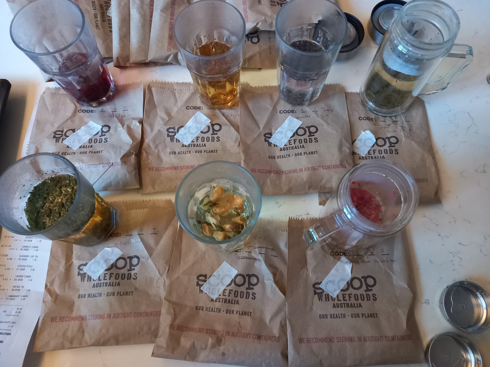

# Teas

This post briefly summarizes the various types of teas (traditional and herbal/flower) and our experiences with them.

<!-- more -->

## Teas with caffeine

These are best drunk before 12pm. One way is to drink green tea in the morning and maybe white tea (lower caffeine content) around noon.

**Broad categories of teas ([source][tea1])**

| Tea | Description |Caffeine (mg per 240ml) | Oxidation | Benefits | Brew |
| --- | ---------------------- |--------------------------| ----------|----------| ----- |
| Black | Darker reddish with a strong flavour| 40 - 70 | Fully | B | 85°C  |
| Green | Pale greenish-yellow with a light and grassy flavour | 25 - 35 | Low | A+ | 70°C  |
| Oolong | Golden brown tea with a very delicate flavour | 30 - 50 | Semi| B | 85°C  |
| White | Light-colored infusion with a mild flavour | 10 -15  | None | A+ | 70°C  |
| Pu-er | Dark-coloured with smooth taste | 60 - 70 | Fully and Aged | B | 90°C  |

**Selected examples we tried**

| Tea | Description | Price ($/kg) | Benefits | Brew |
| --- | ----------- |-------| --------------------| ------------------ |
| Jasmine Green[^jasmine] | Light yellow and refreshing | 138 | High levels of antioxidants | 70°C  |
| Gyokuro Japanese | Sweeter and less astringent tea with | 220 | Higher concentration of nutrients  | 50°C - 60°C |
| White Flowery Pekoe | Rare white tea variety known for its soft floral tones and smoothness | 360 | Very calming and is very high in antioxidants | 70°C  |
| Pai Mu Dan | Rare white tea has a honeydew and jasmine-like perfume, plucked before the buds open to retain their natural nutrients | 200 | High in polyphenols and essential antioxidants good for immune, nerve and blood pressure health. High doses of the amino acid [theanine][theanine], known to calm the nervous system and increase brain health.| 70°C |

## Non-Caffeinated Tea (After 12pm)

Prices are from [Scoop Wholefoods](https://scoopwholefoodsshop.com).

| Tea | Description | Price ($/kg) | Benefits | Brew |
| --- | ----------- |-------| ------------------ | ------- |
| Hibiscus Petals | Magenta colour with a tart berry flavour | 121 (50% off) | Lower blood pressure and reduce cholesterol levels. | 1-3 tsp, and steep in hot water (90C-95C) and let steep for 2-5 minutes.|
| Lavender Flowers | Clear with a flowery taste | 200 | Calming | - | 
| Chamomile Flowers | Dark-coloured with smooth taste | 160 | Calming, antiseptic and antibacterial | 1-2 tsp and steep in hot water (90C-95C) for 3-5 minutes | 
| Rose buds | Plant flavour | 111 | - | - |
| Pomegranate Flower| Very mild flavour | 171 | High in antioxidants and have antibacterial and antiviral properties | 1-2 tsp in hot water (90C-95C) and steep for 2-3 minutes.|
| Rasbberry Leaf | Mild tea flavour | 142  | High in magnesium, potassium, iron and b vitamins | 2-3 tsp and steep in hot water (90C-95C) for 2-5 minutes |
| Blackberry Leaf | Mild flavour | 163 | High in vitamin C and Tannins | - | 
| Nettle Leaf | Earthy, mildly bitter flavour | 45 | High in iron and calcium| 1-3 tsp in hot water (95C-100C) and steep for 2-3 minutes |
| Licorice Root | Sweet taste | 65 | Ease digestive problems | - |
| Rooibos | Herbal flavour | 88 | Great for blood pressure and circulation, healthy skin and strong hair. | - |
| Lemon Myrtle  | Strong, beautiful aroma that can be very calming | 106.8 | Powerful antiseptic and anti-viral agent. | 1-2 tsp and steep in hot water (90C) for 2-3 minutes |
| Lemongrass | Blends very well with ginger and peppermint teas | 150 | Support a healthy digestive system| 1-2 tsp and steep in hot water (90C) for 3-5 minutes |
| Lemon Balm | - | 237.5 | Calm and relax anxiety, nerves and moods | - |
| Ginger | Blends very well with ginger and peppermint teas | - | Support a healthy digestive system| 1-2 tsp and steep in hot water (90C) for 3-5 minutes |
| Iced Tea Thirst Quencher | Overpowering sweet tea flavour | 81 | -| - |

## Individual Notes

**Chanel**

Chanel has shortlisted the lemon, ginger and nettle tea for late afternoon tea. There are some other tea to be evaluated - more lemons and ginger tea. 

**Nicholas**

- Hibiscus tea is nice cold
- Licorice tea is sweet, however [not for long term consumption][licorice-root]
- Ginger tea is warming
- Lemongrass/lemon myrtle tea is refreshing
- Jasmine green tea seems to **suppress my appetite**

[^jasmine]: _"Jasmine tea is typically a subtype of green tea that has been flavored and brewed with jasmine flowers. However, jasmine tea can also have black or white teas as a base."_ ([source](https://foodsguy.com/green-tea-vs-jasmine/))

[tea1]: https://nicholaslyz.com/blog/2022/10/28/nutrition-and-health/#tea
[theanine]: https://nicholaslyz.com/blog/2022/10/28/nutrition-and-health/#l-theanine
[licorice-root]: https://www.healthline.com/nutrition/licorice-root#side-effects