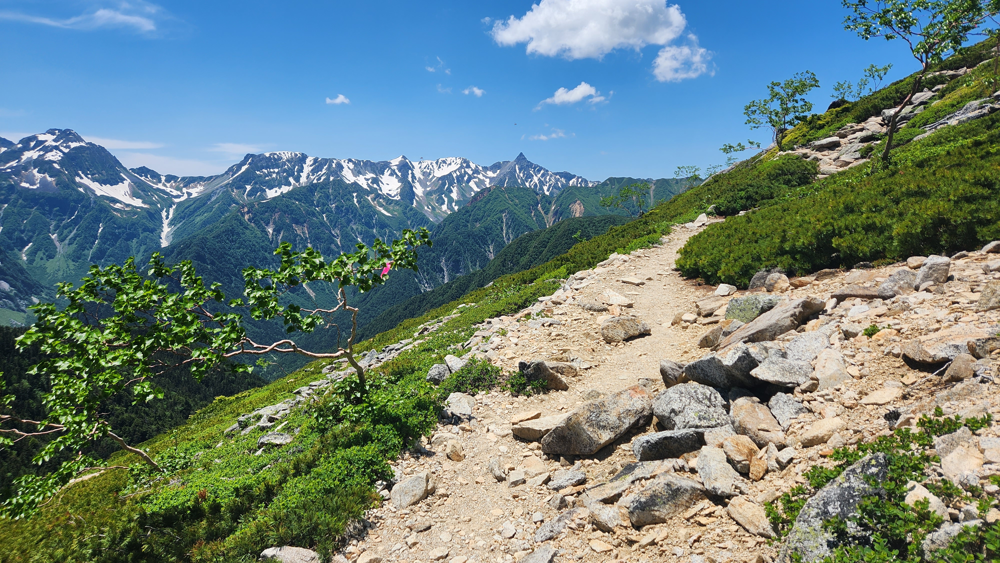

# 2023 Jun: Kamikochi Japan

Our first multiday hike (Panorama Ginza) with camping, from 29 Jun - 9 Jul 2023.

<!-- more -->

<figure style="max-width:300px">
  
  <figcaption>Panorama Ginza Trail (click to enlarge). We started at Taisho Pond (bottom left) and hiked to Nakabusa Onsen (top right) over 5D4N in a tent.<figcaption/>
</figure>

<figure>
  
  <figcaption>Total distance was 76.94km over 5 days (moving time 28hr 6min, average speed 2.6km/h). Total ascent was 3227m, and total descent was 3228m. <a href="/static/2023-04-07/merged.gpx">GPX file</a><figcaption/>
</figure>

This climb was done in summer. The original plan for the hike was taken from this [site][panorama-ginza]. For the actual hike, we climbed to Karasawa Hutte mountain hut on the first day, and then on the second day we went to Chogatake Hutte mountain hut. Subsequently, we followed the Panorama Ginza trail proper.

## Jun 29, Thu: Flight

-   2215 - 0615 (7hr) Flight from Singapore T1 to Tokyo Narita T1 ([TR 808][itinerary])

## Jun 30, Fri: Buying supplies, food

-   0615 Arrived at Tokyo Narita T1
-   Train to Shinjuku ([routes][narita-transport])
    -   [x] Option A: JR Narita Express TOKYO Round Trip Tickets (¥4,070) ([guide][nex-train])
    -   Option B: Keisei Main Line to Nippori Station (¥1,050, 80min) & Transfer to JR Yamanote Line to Shinjuku Station (¥210)
-   Purchase supplies at Don Quijote 24HR (Food), [Yamarent][yamarent], [L-breath][lbreath] (Fuel & Gear)
-   Ate at Ichiran Ramen
-   Took the 1400 Hourly Limited Express Direct Azusa from Shinjuku to Matsumoto (¥6,620) ([schedule][azusa-train-schedule])
-   Explored Matsumoto ([map][matsumoto-map]): went to Aeon Mall, explored Nawate street which was closed at 5pm
-   [x] Stayed overnight at [Iroha Grand Hotel Matsumoto Eki-Mae ($85)][iroha-grand-hotel]

**Nicholas' Journal**

We went to eat Ichiran Ramen for 980yen (+140yen for egg) per person (2140yen total). It was not bad, but not outstanding either. Then, we ate at Himawari Sushi Shintoshin, which was 1750yen for the both of us, and had a variety of sushi. The otoro was okay, I think Hanamaru Sushi would have been better. We left for Matsumoto at 2pm as we were quite tired from the plane ride (overnight).

Of note, we also managed to get our dried packed camp food through customs, even pass a sniffer dog.

**Chanel's Journal**

Chanel insisted on having cake on the train to Matsumoto and she purchase a sinful strawberry shortcake which was just okay (701yen with spoon).

## Jul 1, Sat D1: Taisho Pond to Karasawa Hutte

<figure>
  
  <figcaption>25.44km (+908m/-131m) over 6h55m (3.6km/h) <a href="/static/2023-04-07/D1 Taisho pond to Karasawa Hutte.gpx">GPX file</a><figcaption/>
</figure>

<figure>
  
  <figcaption>Karasawa Hutte Camp Site, surrounded by 4 mountains (2,310m)<figcaption/>
</figure>

-   1010 Took train/Bus to Kamikochi (¥2,710, [schedule][kamikochi-bus-info])
-   1200 Arrived at Taisho Pond at Chanel's request
    -   Refilled water, ate apple ice cream
    -   Filled out [mountain climbing card][trek-itinerary] and put it in the box at the start of the Dakasawa trailhead
-   Started hiking proper
    -   Planned route: ([gpx file][kamikochi-gpx])
    -   Backup: Panorama Trail ([gpx file][panorama-gpx])
    -   Actual route taken was as above
-   Overnight at [Karasawa Hutte, Water point][karasawa]

**Nicholas:**

We went to Yokoo hut and at 430pm, decided to try for karasawa hut (this was despite a sign on the bridge saying that ascending after 2pm was dangerous, as we felt our speed that day was good.). It was raining moderately throughout, and while the route was quite well maintained overall, there were large patches of snow higher up (the entire of the last 200m ascent was in snow). We made good progress however and reached the hut at 7.30pm. The host cleared tables for us to set up our tent. It was a wet night, but luckily the rain stopped sometime around 10 and I went to dry the clothes, brush teeth and wash the pots. We ate curry with soy protein, 5 pieces of freeze dried tofu, cherry tomatoes, mushrooms and 5 slices of bread for dinner.

**Chanel:**

After discussion last night, we were convinced to leave later. Hence, we decided to have breakfast at a quaint soba shop near the station. Chanel had soba and Nicholas had udon. It was the best meal so far in Japan. We bought the 2710yen tickets to kamikochi and additional supplies.

Then, we made the rushed decision to catch the 10.10am train at 9.37am. Chanel didn't think we could make it but we did. This train has more of a rural down to earth feels as it drove through the countryside.

After boarding the bus at shinshimashima Station, Chanel insisted on stopping and walking at Taisho Pond which added 1 hour to our hiking time. At this point in time, we were still unsure of our route.

After a leisurely walk, submitting our forms at kamikochi bus terminal and having apple ice cream, we made our way to Takosawa hut. There was a light drizzle. We met a local who gave us advice about the route. He informed us that the yarigatake route was closed due to a typhoon and recommended Yokoo and Karasawa.

After hearing advice, we decided not to go the dangerous yarigatake route and perhaps try Karasawa if time permits. We passed tokusawa then headed to Yokoo. There was a detour due to construction and we walked through a muddy forested trail. Eventually we reached Yokoo at 4.10pm.

We used the toilets and geared up for the 2.5 hours hike to Karasawa. The rain was intense. The hike was intense. At first, it was a nice forested trail then we ended up walking up the stream and passed some waterfalls. After the intense waterfall stream climb, Chanel thought the hardest part was over for it was beginning of the second hardest part, the ascent.

We climbed endless rocks of steps and passed a cool exposed rock trail. After that, we encountered a small snowfield which we crossed easily but that was just a hint of what was to come.

Eventually, we met our nemesis, a 200m ascent up a steep snow hill with no aim in sight. There was still some light. We climbed upwards and Chanel wanted to give up but Nicholas assured her and let her rest when needed. Finally we saw the rope guiding us to yet another rock steps to the hut.

It was raining heavily and we entered the hut to pay for the tent space. The hut manager gave us a spot under the shelter given the rain. We scrambled to set up the tent and Chanel hid inside and Nicholas set things up.

We had curry with bread. Peanut butter is not recommended with curry. The bread was really good though. Tofu and soy protein was the highlight. Too tired to even have tea, we settled to sleep.

## Jul 2, Sun D2: Karasawa Hutte to Chogatake Hutte

<figure>
  
  <figcaption>19.58km (+1075m/-701m) over 7h19m (2.6km/h) <a href="/static/2023-04-07/D2 Karasawa to Chokagatte.gpx">GPX file</a><figcaption/>
</figure>
<figure>
  
  <figcaption>Chōgatake Hütte Camp Site, overlooking Azumino (2,670m)<figcaption/>
</figure>
-   Karasawa -> Yoku Valley (-690m) -> Yokoo Junction (+1,000m) -> Chogatake Hutte
-   Overnight at [Chogatake Hutte][chogatake]

**Nicholas' Journal**

Today was the 800m descent to Yokoo, then the 1000 ascent to Chogatake hut. The ascent was very tiring and we stopped every 200m. However Chanel managed to pull through surprisingly with minimal help (I carried the water). Breakfast was chocolate oats. Lunch was miso soup with 2 slices freeze dried tofu. Dinner was somen noodles with fish stock, freeze dried tofu, soy protein and miso soup (very nice, like mee sua). For the tent pitching site, it was very windy and I used rocks with buried tent pegs to secure the tent.

## Jul 3, Mon D3: Chogatake Hutte to Jonen-goya

<figure>
  
  <figcaption>10.91km (+549m/-758m) over 5h22m (1.8km/h) <a href="/static/2023-04-07/D3 Chogatake to Joten.gpx">GPX file</a><figcaption/>
</figure>
<figure>
  
  <figcaption>Jonen-goya Camp Site, with a view of Yarigatake (2,450m)<figcaption/>
</figure>

-   Chogatake Hutte -> Mount Jonen -> Jonen-goya
-   Overnight at [Jonen-goya][jonen]

**Nicholas' Journal**

Today was the traverse along the panorama ridge to Jonen hut. The ascent up Jonen looked very menacing. Possibly because of the hot weather, we were slower than expected. We reached the hut earlier than the previous day. Today, we ate mushroom oats for breakfast, and 200gm of nuts with chocolate for lunch and snacks. I managed to wash dishes with drinking water. Water consumption today was approx 6L for 2 of us. 1.5L of water for 2 people for the hike to Jonen was insufficient. We will try 2.5L tomorrow. Dinner was 300gm pasta and 5 pieces of freeze dried tofu. Sleep was better tonight. I dried myself with wet wipes. I should sleep in a different set of attire from what I climb in.

Chanel needs to get a thinner wool base layer and pants, and a proper sleeping bag. I can kiv get wool t shirts, wool underwear and a better pants and top outershell.

Chanel said she wanted to drink coke and eat ice cream when she gets back to the city.

The stars were out tonight. Chanel's phone was able to photograph them. I should get a better phone.

**Chanel's Journal**

Chanel wanted to give up the 400m steep ascend to Mt Jonen. Even after reaching the top, it was a very rocky 400m descend to the hut.

## Jul 4, Tue D4: Jonen-koya to Enzan-so

<figure>
  
  <figcaption>13.38km (+705m/-469m) over 5h56m (2.1km/h) <a href="/static/2023-04-07/D4 Jogen to Ensanso.gpx">GPX file</a><figcaption/>
</figure>
<figure>
<a href="/static/2023-04-07/enzansou.jpg">
  <figcaption>Sunset at Enzan-so (2,712m)<figcaption/>
</figure>

-   Jonen-koya -> Mt. Otensho -> Enzan-so Mountain Hut
-   Overnight at [Enzan-so Mountain Hut][enzansou]

**Chanel's Journal**

Today was the most scenic trail out of all the 4 days.

<figure>
  
  <figcaption>Photo taken by a Japanese hiker who passed us again on her way back<figcaption/>
</figure>

For breakfast, Chanel failed making the polenta and burnt the pot so we settled with granola instead. We walked along the ridge with pretty views of the mountain and path. We encountered a pair of Caucasian females at least 6 times on the route to ensanzo hut. We overtake them during descents and they overtook us during ascents because Chanel was too tired by then. We reached Daitenso hut at around 12pm after many false hope that it was around the corner. We had tofu and rice paper noodles for lunch before starting our climb down and up to the final hut. Nicholas found a quiet corner spot for our tent and we took pictures of the sunset. Chanel huddled in Nicholas' jacket while waiting for him. We had failed ramen pasta and toasted chocolate marshmallows for dinner. Nicholas did a smart double boil for the chocolate to save clean up.

Boil water first before throwing it powder/carbs.

## Jul 5, Wed D5: Enzan-so to Nakabusan Onsen, cycling from Azumino to Matsumoto

<figure>
  
  <figcaption>7.26km (+0m/-1145) over 2h33m (2.8km/h) <a href="/static/2023-04-07/D5 Ensanso to Nakabusa onsen.gpx">GPX file</a><figcaption/>
</figure>
<figure>
  
  <figcaption>Stopover at the Farmers' Market<figcaption/>
</figure>

-   Enzan-so Mountain Hut -> Nakabusan Onsen
-   1045 Took regular bus from Nakabusan Onsen to Azuminosato Station (55min, [schedule][nakabusa-bus-schedule])
-   Arrived at Azuminosato and rented Hello Cycling Bicycles
    -   Visit Daio Wasabi Farm
    -   Ate soba for lunch at [Sekiya Azumino][sekiya]
-   Cycled from Azumino to Matsumoto ([route][azumino])

**Chanel's Journal**

Finally it was the day of descent down to Nakabusa Onsen. Chanel woke Nicholas and insisted that we should make only one trip to the mountain hut and then go down even though she wanted to go toilet. We had somen instead of the sad oats for breakfast. After the toilet break and returning the tags, we climbed down 1200m to the onsen and paid 950yen per pax for the use of onsen. Towels and moisturizer were not provided but the onsen was good. The shop owner even gave us a free mini ice cream. Chanel likes ice cream. We caught the last two seats of the 10.50am bus to Azumino. Nicholas calmly handled the discussion with the bus driver on the last stop. We found free water and downloaded the Hello Cycling App. Chanel was scared cycling the heavy electric bicycle but Nicholas was high on the acceleration. We visited Daio farm where they sold overpriced souvenirs. Nicholas recommended a good soba restaurant and we ate well. On our way back to Matsumoto, we visited the farmers' market, horse ranch and a big supermarket. Nicholas was blinded by the potential of a huge adult shop in the middle of nowhere. We did not have enough time to visit the castle. We dropped our bags and went to the mall before returning our bicycles at the station. Nicholas bought many fruits for a second round of chocolate dipping.

**Nicholas' Journal**

The soba restaurant was surprisingly good and reasonable (something around $20/person). The name of the restaurant was Sekiya Azumino. The wasabi farm was overpriced. I liked the cycling around the beautiful green countryside. I think a farmer's life is quite enviable - simple, no politics, and honest.

## Jul 6, Thu: Matsumoto to Nagiso, hotpot for dinner

-   0800 Breakfast at [Soba noodle shop in Matsumoto][matsumoto-soba]
-   1200 Travel to Nagiso ([routes][matsumoto-tsumago])
    -   Option A: 1500 Take Shinano No. 16/18 (¥ 3,000, 1hr)
    -   [x] Option B: 1600 JR Shinonoi Line/JR Chuo Main Line (¥1,500, 2hr) to Nagiso
-   [x] Overnight at Nagiso ([お宿 勝, $150][nagiso-accoms])

**Chanel's Journal**

We went back down for some good old udon again and Chanel went to take a walk and met random (probably gay) Austrialian-Singaporean couple at Matsumoto Castle. She bought ice pops on the way back. Nicholas was intensely coding. We had delicious curry instead of the 12pm Karaage Centre food. We boarded the train to the quiet town of Nagiso where we made the decision to cook dinner. After scouting 2 supermarkets, we purchased sweet potato, carrot, fish roe, liver, pork belly, leek, baicai, mushrooms and some alcohol to have a nice hotpot at the balcony facing the river.

**Nicholas' Journal**

In the morning, I was trying to fix an issue with my `virt-manager` container on my server being unable to connect to `libvirtd` despite it running. We ate nice udon at the quaint Japanese noodle shop.

Nagiso was a very quiet town, and I liked the sound of the running water of the river just outside our place (an actual person's residence, Airbnb style). The fresh food at the markets made for very nice cooking. We had sufficient fuel leftover for the hotpot surprisingly. With the penknife, we were able to prepare the hotpot, as well as a Japanese melon.

## Jul 7, Fri: Tsumago-Magome trail, back to Tokyo

<figure>
  
  <figcaption>6.14km (+417m/-37m) over 1h38m (3.7km/h) <a href="/static/2023-04-07/Tsumago to Magome.gpx">GPX file</a><figcaption/>
</figure>

-   0840 Bus from Nagiso Station to Tsumago ([schedule][nagiso-bus-schedule])
-   0900 Magome-Tsumago Trail (planned: 6.6km, 2hr 15min, [gpx file][magome-tsumago]), end at Magome
    -   Actual: Started at Tsumago, took a bus halfway (see GPX file above)
-   1100 Lunch at Magome (soba noodle shop)
-   [x] 1130-1613 Express bus from Chuodo-Magome ([map][chuodo-magome-bus-stop]) to Shinjuku ([ticket][magome-shinjuku])
-   [ ] Explore Kabukicho, Omoide Yokocho in Shinjuku
-   [x] Ate at Udon Shin, Torikizoku
-   [x] Overnight at Tokyo ([Shinjuku Granbell, $135][shinjuku-granbell])

**Chanel's Journal**

We finished our oats and peanut butter for breakfast before catching the 8.47 bus to the deserted town of Tsumago. We made a attempt to hike the trail and passed a nice waterfall before getting exhausted at 10.32am where we saw the bus stop sign with the hopes of an approaching bus at 10.33am. The bus saved us and we made it to Magome at 10.45am. We had to walk further to the bus station where we had some of the best green teas. The nice bus driver gave us 2 extra seats for our bags and we were bound for Shinjuku. We checked into our hotel at the dodgey area of kabukicho before heading out for dinner. Udon shin was a disppoinment but torizuko was awesome. We were tired of walking and took the train back to our hotel.

## Jul 8, Sat: Last day in Tokyo

-   Souvenir Shopping
    -   Shibuya: Shibuya Center-gai, Shibuya Crossing, Scramble Square, Mandarake manga store and Meikyoku Kissa Lion classical music cafe
    -   Yokohama: Chinatown, Motomachi Shopping District, Cup Noodle Factory, Gundam Factory
-   [ ] (missed) Take Narita Express Train from Shibuya/Yokohama to Narita Airport
-   [x] Took Sobu Rapid at 2124 to Narita Airport T1, then hotel shuttle
-   [x] Overnight at Tokyo in [Narita Tobu Hotel Airport ($119)][airport-hotel]

**Chanel's Journal**

It was the last day in Tokyo. We checked out at 11am and purchased the Tokyo Day Pass and headed to Tokyo Station. We found the lockers within the JR station but may have wasted our NEX JR pass. After squeezing out luggage into one large 700yen locker, we went to Ginza to take a queue number for hanamaru sushi. There were 96 groups ahead of us at 12.15pm. While waiting, we visited GU and Uniqlo and went to Akihabara before realising that it would be our turn soon. Hence, we turned back with a waffle and had really good sushi at Ginza at 3pm. After lunch, we walked around the area because Chanel wanted to find lipstick and shop. Eventually, we went back to Akihabara to see more shops and have Torizuko again. It was here at 7pm when we realised that the last NEX train leaves Tokyo at 8.02pm and we were misled by the poor UI design of the JR ticket reservation machine. We had to miss the train and purchased another route to the airport. We purchased a small carry-on luggage from Ginza Karen and took the Sobu Rapid Line to Narita and caught the 11.10pm hotel shuttle.

## Jul 9, Sun: Flight home

-   0530: Take shuttle bus to Narita T1 ([schedule][airport-shuttle-schedule])
-   0815 - 1350 (6h 35min) Flight from Tokyo Narita T1 to Singapore T1 ([TR 809][itinerary])

## Miscellaneous

### Camping Food

<figure>
  
  <figcaption>The food we brought up with us. Ramen, freeze dried tofu (for Nicholas) and textured soy protein were overall good choices.<figcaption/>
</figure>

Water consumption for 2 pax:

-   Breakfast - 1L
-   Lunch - 1L
-   Hiking - 2L minimum
-   Dinner - 1L

In total for a full day approximately 3L is required for each person.

|       | B                        | L                                         | S           | D                                                                                                    |
| ----- | ------------------------ | ----------------------------------------- | ----------- | ---------------------------------------------------------------------------------------------------- |
| Day 1 | Soba Noodles @ Matsumoto | Apple ice cream, plums, cucumber          | Wasabi Peas | Curry with soy protein, 5 pieces freeze dried tofu, cherry tomatoes, mushrooms and 5 slices of bread |
| Day 2 | Chocolate oats           | Miso soup with 2 pieces freeze dried tofu | Wasabi Peas | Somen noodles with fish stock, freeze dried tofu, soy protein, miso soup                             |
| Day 3 | Mushroom oats            | 200gm mixed nuts with chocolate           |             | 300gm pasta with 5 pieces freeze dried tofu, spices                                                  |
| Day 4 | Granola                  | Rice paper, miso soup, freeze dried tofu  | Nuts        | Ramen with soy protein, chocolate fondue marshmallows                                                |
| Day 5 | Somen with miso soup     |                                           |             |                                                                                                      |

### Total Cost

??? note "Total Cost"

    -   Flights: $664
    -   \[5N\] Accoms: $570/2 = $285
    -   \[4N\] Tent space: $80
    -   Food: $365
    -   Transport: $241
        -   Within Tokyo: $65
        -   Shinjuku to Matsumoto: $66
        -   Matsumoto to Kamikochi: $27
        -   Nakabusa to Azumino: $15
        -   Azumino to Matsumoto: $15
        -   Matsumoto to Nagiso: $15
        -   Nagiso to Magome: $6
        -   Magome to Shinjuku: $32
    -   Others:
        -   Insurance: $28
        -   SIM cards: $14

Approximate total cost per person: **SGD 1677**

### Packing List

??? note "Packing List"

    **On the day**

    -   T-shirt/jeans
    -   Slippers/Crocs
    -   Travel adaptor & cable
    -   Powerbank
    -   Handphone
    -   Wallet, cash & youtrip card
    -   Passport
    -   Earplugs
    -   Eye mask
    -   Kindle/Kobo
    -   Laptop + charger

    **In Japan**

    -   Helmet - rent at Kamikochi Visitor Center
    -   Camping Gas

    **Miscellaneous**

    -   First aid kit (plasters, dressings, diarrhea meds, panadol)
    -   Plastic bags
    -   Ziploc bags
    -   Face mask
    -   Duct tape?
    -   Camera (KIV)

    **Navigation**

    -   Compass
    -   Gaia maps app with map files loaded
    -   Physical map (take from visitor center)

    **Clothing**

    -   Fleece
    -   Down jacket
    -   Waterproof jacket
    -   Gloves
    -   Socks
    -   Thermal wear top
    -   Thermal wear bottom
    -   Underwear
    -   City attire (T-shirt/jeans/s attire)
    -   Trekking shoes
    -   Sunglasses

    **Toiletries**

    -   Toothbrush, toothpaste, shaver
    -   Soap
    -   Shampoo
    -   Moisturizer
    -   Sunscreen
    -   Lip balm
    -   Hand sanitizer
    -   Powder detergent (to wash clothes)
    -   Toilet paper
    -   Body/ Wet wipes

    **Cooking**

    -   Liquid detergent (in bottle, small amount)
    -   Stove
    -   Pots + Cutlery
    -   Water purification tablets
    -   Sponge
    -   Water bottle (at least 2L)
    -   Thermos flask (optional)

    **Camping Gear**

    -   Backpack 60L
    -   Head lamp with battery
    -   Sleeping bag
    -   Sleeping bag liner
    -   Towel
    -   Penknife
    -   Chair
    -   Tent

### Things to improve on in the future

??? note "Things to improve on"

    **General**

    - Inclusion of bus/train schedules to know when the last train/bus is
    - Planning around long restaurant queues - get queue ticket as the first thing
    - Book the same hotel at the start and end of the trip to be able to store luggage
    - Avoid spending time in major cities

    **Hiking**

    - Packing:

        - Having a waterproof backpack is important
        - Consider putting clothes and sleeping bag in drysack
        - Always overpack for warmth at night and uv tops for sunny day hikes
        - Having warmer layers than the weather suggests is important
        - UV sleeves/adequate sunblock as exposed sun is strong
        - Having a cap/umbrella is important
        - A small umbrella is useful for blocking out sunlight but not good if windy
        - A small towel is good enough
        - Consider disposable underwear
        - Consider water bag
        - Use big Ziploc bags for trash
        - Bring super glue
        - A watch is useful for checking sunset times quickly when estimating speed

    - Food/Cooking:

        - 250g fuel was enough for 5D4N 2 pax worth of cooking
        - Japanese granola is not legit
        - Chanel wants to bring biscuits
        - A titanium pot might allow for better heat distribution
        - Metal utensils are better
        - Noodles were the best and most convenient cooking food
        - Melting chocolate in a plastic bag is legit (plastic bag should ideally be big enough to cover the pot so dipping is easy)

    - Miscellaneous

        - A good phone camera is important
        - Check weather beforehand to avoid carrying excess attire
        - Put harder sections at the end of the route as weight will be less
        - Start hiking early so there is more time to decide what to do

### Reference Maps & Guides

-   [Kamikochi Trail GPX][kamikochi-gpx]
-   [Panorama Ginza Trail GPX][panorama-gpx]
-   [Kiso Valley Trail GPX][magome-tsumago]
-   [Kamikochi Map][hike-map] ([trekking guide][trek-guide])
-   \[3 - 4 days\] [Panorama Ginza Trail][panorama-ginza] ([Map][panorama-ginza-map]) ending at [Nakabusa Onsen][nakabusa]
-   \[2- 3 days\] [Mt Hotaka Loop][mt-hotaka] similar to the reddit one you shared
-   [Hotaka Mountains (Highest peak Mt. Oku-hotaka-dake) hiking & climbing route](https://thejapanalps.com/en/route/mt-hotaka/route-02/)
-   [Kamikōchi to Mt. Hotakadake](https://randomwire.com/mount-hotaka-revisited/)
-   [Mt. Hotaka-dake Difficult Location Detailed Route Guide -The Karasawa Route-](https://thejapanalps.com/en/nakata-map/okuhotaka/)
-   [Mt. Yari-gatake](https://thejapanalps.com/en/route/mt-yarigatake/)

### Suggested Treks (courtesy of Chanel)

Prices excluding flights.

-   \[8D7N\] [India Tarsar Marsar Trek 4021m in Aug for SGD575][india-trek]
-   \[7D6N\] [North Africa Jebel Toubkal 4,167m for SGD899][north-africa-trek]
-   \[9D8N\] [Russia Mount Elbrus 5642m for SGD1675][russia-trek]
-   \[20D19N\] [Tajikistan Lenin Peak 7,134m in Jul for USD2200][tajikistan-trek]

[yamarent]: https://www.yamarent.com/en?language=en
[lbreath]: https://goo.gl/maps/TC7o16L62ei5oeJ68
[azumino]: https://www.snowmonkeyresorts.com/2019/04/cycling-through-rural-azumino-to-matsumoto-castle/
[matsumoto-map]: https://visitmatsumoto.com/wp-content/uploads/2023/04/TownWalkingMap_EN.pdf
[hike-map]: https://www.hikemasterjapan.com/_files/ugd/60507d_b5b49614a7f740b98684e04c7a4e462a.pdf?index=true
[trek-guide]: https://www.kamikochi.org/plan/trekking
[trek-itinerary]: https://www.pref.nagano.lg.jp/kankoki/smartphone/trekking.html
[panorama-ginza]: https://www.hikemasterjapan.com/panoramaginza
[panorama-ginza-map]: https://static.wixstatic.com/media/60507d_88f3c201ff294078b635af703a2eae9e~mv2.jpg?dn=Kamikochi%20Map%20Azumino%20Panorama%20Ginza.jpg
[mt-hotaka]: https://www.hikemasterjapan.com/hotaka
[dehydrate-food]: https://www.rei.com/learn/expert-advice/how-to-dehydrate-food.html
[kamikochi-gpx]: ../../static/blog/2023-04-07/2023-06-kamikochi.gpx
[panorama-gpx]: ../../static/blog/2023-04-07/2023-06-panorama-ginza.gpx
[magome-tsumago]: ../../static/blog/2023-04-07/magome-tsumago.gpx
[iroha-grand-hotel]: https://www.booking.com/Share-MYTWNC
[dakasawa]: https://thejapanalps.com/en/mountain-hut/takesawagoya/
[karasawa]: https://thejapanalps.com/en/mountain-hut/karasawahyutte/
[chogatake]: https://thejapanalps.com/en/mountain-hut/chogatake/
[jonen]: https://thejapanalps.com/en/mountain-hut/jonengoya/
[enzansou]: https://thejapanalps.com/en/mountain-hut/enzanso/
[daitensou]: https://thejapanalps.com/en/mountain-hut/daitenso/
[nakabusa]: https://thejapanalps.com/en/access-nakabusa/
[nagiso-accoms]: https://www.booking.com/Share-QgwY131
[shinjuku-granbell]: https://secure.booking.com/confirmation.en-gb.html?aid=337862;auth_key=CGyWzSDRKiH2Akaf&;source=conf_email;pbsource=conf_email_modify;pbtrack=email_mainCTA;from_conf_email_tracking=1
[airport-hotel]: https://www.booking.com/hotel/jp/holiday-inn-tobu-narita.html
[narita-transport]: https://tokyocheapo.com/travel/narita-to-shinjuku/
[nex-train]: https://tokyocheapo.com/travel/narita-express-nex/
[azusa-train-schedule]: https://www.snowmonkeyresorts.com/wp-content/uploads/2022/03/Shinjuku-Matsumoto-1.png
[matsumoto-train]: https://japantravel.navitime.com/en/area/jp/route/result?start=00003876&goal=00007171&start_name=Matsumoto&goal_name=Nagiso&date_time=2023-07-06T15%3A36
[kamikochi-bus-info]: https://www.kamikochi.org/pdf/Kamikochi_Leaflet.pdf
[nakabusa-bus-schedule]: https://azumino-e-tabi.net/pdf/p3-4.pdf
[matsumoto-tsumago]: https://japantravel.navitime.com/en/area/jp/route/result?start=00003876&goal=00007171&start_name=Matsumoto&goal_name=Nagiso&date_time=2023-07-06T15%3A36
[nagiso-bus-schedule]: https://www.japan-guide.com/bus/kiso.html
[magome-shinjuku]: https://www.kousokubus.net/JpnBus/en/WebTicket/Index/busnetticket-20230606233731.pdf?key=Pov6rzaByzpoCd7vkMw4EoL7SfRA9m32
[magome-bus]: https://www.kousokubus.net/JpnBus/en
[magome-bus-info]: http://time.jrbuskanto.co.jp.e.wn.hp.transer.com/bk06020.html
[chuodo-magome-bus-stop]: https://goo.gl/maps/QVXinZNFBQdWWkSD7?coh=178571&entry=tt
[airport-shuttle-schedule]: https://www.tobuhotel.co.jp/narita/access/pdf/bus_tt_img_airport_02.pdf
[willer]: https://willerexpress.com/en/bus_search/tokyo/all/nagano/kamikochi/ym_202306/day_28/?stockNumberMale=1&stockNumberFemale=1
[alpico]: http://sawayaka.alpico.co.jp/
[climbing-bus]: https://bus.maitabi.jp/tour_catsearch.html?departure=1&month=7&area=17&style=3&page=1
[itinerary]: ../../static/blog/2023-04-07/itinerary.pdf
[sekiya]: https://goo.gl/maps/RcmRhgYsF4kuRnux5
[matsumoto-soba]: https://goo.gl/maps/Cp1ZYLPZgUthgxR3A
[india-trek]: https://sgtrek.com/event/kashmir-tarsar-marsar-trek-2023/
[north-africa-trek]: https://sgtrek.com/event/climb-mt-toubkal-2023/
[russia-trek]: https://sgtrek.com/event/mt-elbrus-classic-south-route-2023/
[tajikistan-trek]: https://sgtrek.com/event/guided-expeditions-to-lenin-peak-2023/
