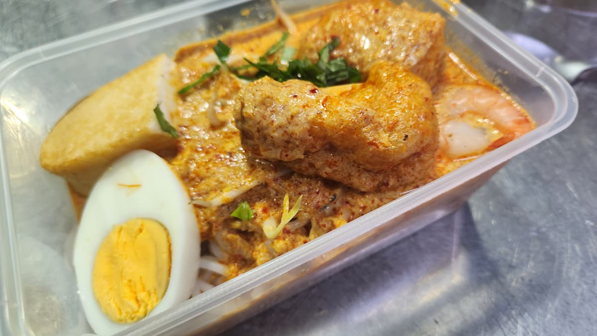

# Uniquely Singaporean Dishes

We attended this class on 2023-10-16. We felt it was not taught as well as the [previous] course, and the dishes were not sufficiently outstanding to justify making them at home (given that hawker centers sell them for cheap prices).

View the recipe book [here].

<!-- more -->

## Notes

### Prata

-   When kneading, ensure color is even. Then leave for 20mins to rest for autolysis. It will become easier to smoothen after.
-   Round the dough when preparing portions

### Laksa

-   When frying the prawn heads, ensure oil is smoking before adding prawn heads. Cook until prawn heads bedtime slightly charred. Deglaze by adding a bit of water and scraping clean, then adding more water.

-   After draining, crush the prawn heads to get the flavor back.

#### Rempah

-   Put softer ingredients before harder ingredients.
-   You can do a big batch and fry it, then freeze it.
-   Add water from soaking dried shrimp to the prawn broth.
-   You can also buy toasted belachan powder.

Steps:

-   Heat oil in pot until hot enough such that rempah sizzles when being added.
-   Stir fry on medium heat, scraping the bottom. Add more oil if necessary.
-   Stir fry until oil separates.

### Nasi lemak

-   Chillies can have seeds remove for less heat
-   Seeds last longer than powder. Dry heat them to extract flavor. Seeds will pop when done
-   When combining cumin, fennel and coriander, cumin is the strongest, coriander is the weakest, so use accordingly.
-   For pounding, pound dry ingredients first. Don't do it to a powder, keep some texture. Wet pounding uses more of a banging motion than dry pounding.
-   When cutting the chicken, score it, to improve the marinade.

#### Rice

-   Soak for 2 hours, then rinse until water runs clear.
-   Ratio of coconut milk to water is 1:2.
-   Heng guan coconut milk tastes better than Kara. Kara is thicker and sweeter.
-   When selecting Pandan leaves, select short and fat and dark ones for more flavor.
-   Pound Pandan leaves and garlic before adding to the mixture.
-   A bit of butter/oil can be added at the end to give the rice a shine.
-   Crush and then knot the Pandan leaves before adding.
-   There will always be a crust at the bottom, so add more rice than necessary.
-   Add sugar to anchovies to fry it into ikan bilis.

#### Sambal tumis telur

-   Add ikan bilis, then sugar + belachan. Add more oil as necessary

-   Then after adding water, add more water until you have a thick enough paste to coat the egg. Add salt/sugar as necessary.

## Misc

Baba curry is the best brand

[previous]: 2023-05-14%20Cooking%20class.md
[here]: ../../static/blog/2023-10-16/2023-10-16%20Uniquely%20Singaporean%20Dishes.pdf