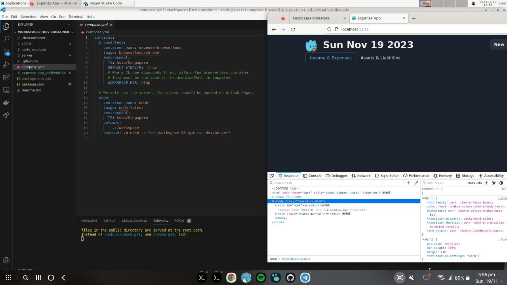

# Visual Studio Code with Remote-SSH on Samsung Dex (using Termux)



Such powerfull portable devices from phones to tablets made available to us yet we are not provided with an equivalent capable code editor application on their systems (Android/iOS).

This posts describes our journey in getting a full Visual Studio Code running with Remotes (SSH) capabilities on a Samsung Dex device.

<!-- more -->

## References

- [Ivon's Blog: How to install proot Debian in Termux on Android phone (XFCE desktop + Audio + One-click starter)](https://ivonblog.com/en-us/posts/termux-proot-distro-debian/)
- [Ivon's Blog: Tutorial on running full Visual Studio Code on Android phone (Termux)](https://ivonblog.com/en-us/posts/visual-studio-code-termux/)
- [Android Docs: Phantom cached and empty processes](https://github.com/agnostic-apollo/Android-Docs/blob/master/en/docs/apps/processes/phantom-cached-and-empty-processes.md)

## 1. Set up Termux and Termux-X11

1. Prerequisites: Recommended specifications on phone/tablet

   - RAM: > 8GB
   - Storage: > 10GB
   - Processor: Qualcomm Snapdragon 845 or above

2. Download the latest [Termux APK] and install on device
3. Download the latest [Termux-x11-arm64-v8a-debug APK] and install on device
4. Launch Termux and install x11-repo and termux-x11-nightly.

   ```bash
   pkg update
   pkg install x11-repo
   pkg install termux-x11-nightly
   ```

5. Install a proot-distro Debian

   ```bash
   termux-setup-storage
   pkg install proot-distro pulseaudio vim
   ```

## 2. Install proot-distro (Debian)

1. Install proot-distro and pulseaudio
   ```bash
   pkg update
   termux-setup-storage
   pkg install proot-distro pulseaudio vim
   ```
2. Create .profile with VIM:
   ```bash
   vim ~/.profile
   ```
3. Download Debian rootfs using proot-distro
   ```bash
   proot-distro install debian
   ```

## 3. Set up proot-distro (Debian)

1. Log into Debian proot as root
   ```bash
   proot-distro login debian --user root --shared-tmp
   ```
2. Install sudo, vim, Firefox
   ```bash
   apt update
   apt install sudo vim firefox-esr
   ```
3. Change root password
   ```bash
   passwd
   ```
4. Add group “wheel” and “video”
   ```bash
   groupadd storage
   groupadd wheel
   groupadd video
   ```
5. Add new regular user named “user” and change password
   ```bash
   useradd -m -g users -G wheel,audio,video,storage -s /bin/bash user
   passwd user
   ```
6. Add regular users to sudoers. Type `visudo` and add this in the next line below `root ALL=(ALL:ALL) ALL`
   ```bash
   user ALL=(ALL:ALL) ALL
   ```

## 4. Set up desktop environment & locales

1. Switch to user
   ```bash
   su user
   ```
2. Install desktop environment
   ```bash
   apt install xfce4 xfce4-goodies
   ```
3. Setup locales
   ```bash
   ln -sf /usr/share/zoneinfo/Asia/Singapore /etc/localtime
   ```

## 5. Set up shell script to start desktop environment

1. Install [Termux API APK] and [Termux Widget APK]. Go to system settings → all apps, turn on “Permit Drawing Over Other Apps” for Termux.

2. Restart Termux. Create shell script in Termux (not in proot-distro)

   ```bash
   mkdir .shortcuts
   vim .shortcuts/startproot_debian.sh
   ```

   ```shell
   #!/bin/bash

   killall -9 termux-x11 Xwayland pulseaudio virgl_test_server_android termux-wake-lock

   termux-toast "Starting X11"
   am start --user 0 -n com.termux.x11/com.termux.x11.MainActivity
   XDG_RUNTIME_DIR=${TMPDIR}
   termux-x11 :0 -ac &
   sleep 3

   pulseaudio --start --load="module-native-protocol-tcp auth-ip-acl=127.0.0.1 auth-anonymous=1" --exit-idle-time=-1
   pacmd load-module module-native-protocol-tcp auth-ip-acl=127.0.0.1 auth-anonymous=1

   virgl_test_server_android &

   proot-distro login debian --user user --shared-tmp -- bash -c "export DISPLAY=:0 PULSE_SERVER=tcp:127.0.0.1; dbus-launch --exit-with-session startxfce4"
   ```

3. Make it executable.
   ```bash
   chmod +x .shortcuts/startproot_debian.sh
   ```
4. Go to your home screen, long press and add widgets → select “Termux Widget”

## 3. Install Visual Studio Code

1. Start desktop environment

2. Launch firefox and ndownload [Visual Studio Code .deb Arm64]

3. Open the terminal and install code
   ```bash
    sudo apt install ~/Downloads/code*.deb
   ```
4. Edit Desktop Entry of VSCode by adding `--no-sandbox`
   ```bash
    vim /usr/share/applications/code.desktop
   ```
   ```bash
   Exec=/usr/bin/code --unity-launch %F --no-sandbox
   ```
5. Add Visual Studio Code Launcher on Desktop
6. Launch VSCode, sign in to sync your settings and start coding with your favourite extensions e.g. Remote-SSH

## 4. Disable phantom process killing


Phantom (forked) processes created by Termux may be killed by Android System to prevent excessive CPU usage, resulting in `[Process completed (signal 9) - press Enter]` error.

1. Prerequisites:
   - Android 12L, 13 and higher
   - ADB debugging enabled on phone
2. On your PC, download [Android SDK Platform-Tools for Linux]
3. Connect the phone to PC.

4. Open ADB shell and disable phantom process killing

   ```bash
    ./adb shell "settings put global settings_enable_monitor_phantom_procs false"
   ```
Note: This blog was edited using VSCode on Samsung S22 with Dell Monitor, Logitech K580 and M350.

[Termux APK]: https://f-droid.org/en/packages/com.termux/
[Termux-x11-arm64-v8a-debug APK]: https://github.com/termux/termux-x11/releases/tag/nightly
[Termux API APK]: https://f-droid.org/packages/com.termux.api/
[Termux Widget APK]: https://f-droid.org/zh_Hant/packages/com.termux.widget/
[Visual Studio Code .deb Arm64]: https://code.visualstudio.com/download
[Android SDK Platform-Tools for Linux]: https://dl.google.com/android/repository/platform-tools-latest-linux.zip

