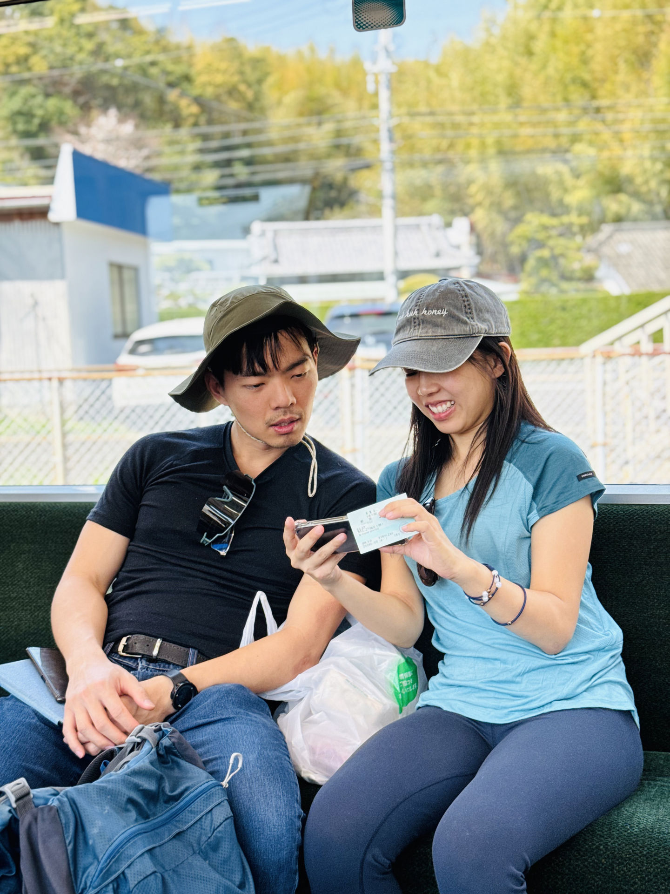
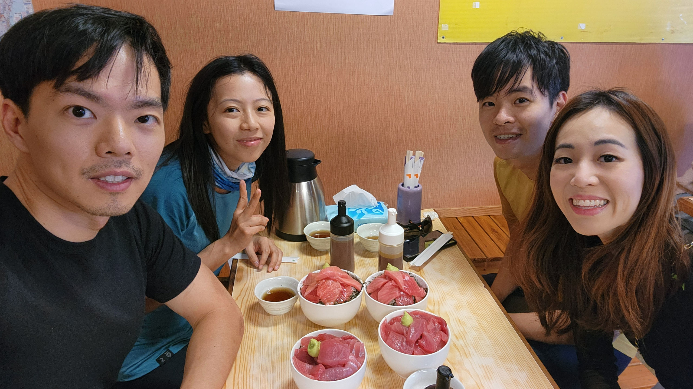
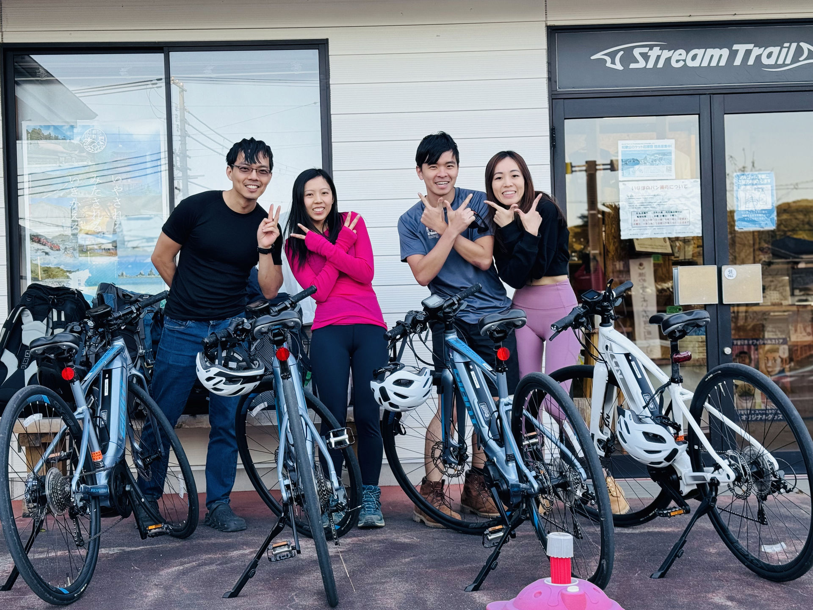

# 2024 March: Kumano Kodo, Japan

This hike was done together with Nicholas' siblings and cousins in late March - April, 2024.

<!-- more -->

## Itinerary

### 26 Mar: Osaka

-   15:50: Nicholas, Benjamin, Jessica, Elizabeth, Whai Hoon arrived in Osaka KIX via TR 818
-   Dinner at [Katsugyosushi], a conveyor belt sushi restaurant
-   Overnight in Osaka at [Centrage Ark Shinsaibashi](https://www.booking.com/Share-FdWUxBC)

### 27 Mar: Chanel arrives in Osaka

-   08:40: Chanel arrived in Osaka KIX
-   Breakfast at [Kitatake Udon]
-   Shopping/snacks
-   Pancakes
-   Shopping at Mont Bell and other places in the city
-   Nicholas met Satoshi in the evening
-   Overnight in Osaka at [Centrage Ark Shinsaibashi](https://www.booking.com/Share-FdWUxBC)

Chanel landed tired but Nicholas picked her up in the cold station and let her shower while he did very a difficult telemedicine quiz. We then had udon since ramen was closed. After a very tasty cake, Nicholas escorted Chanel back home for more sleep.

### 28 Mar: Hike from Takijiri to Takahara

-   9am Train from Osaka to Kii-Tanabe (~3 hrs)
-   Lunch
-   Bus from Kii-Tanabe to Takijiri (~40 min)
-   Walk from Takijiri-oji to Takahara (3.7 km, ~2.5 hrs)
-   Overnight at [SEN.RETREAT TAKAHARA](https://www.booking.com/hotel/jp/sen-retreat-takahara.html?aid=304142&label=gen173nr-1FCAEoggI46AdIM1gEaMkBiAEBmAExuAEZyAEP2AEB6AEB-AECiAIBqAIDuALa_ourBsACAdICJDNkNjNmZjUxLTJiMzMtNDcwNi1iZjJiLTI1NTNlYTFlODI0MNgCBeACAQ&sid=f634309bdae467551669d8e4798dbb75&all_sr_blocks=912679401_380574020_7_17_0;checkin=2024-03-28;checkout=2024-03-29;dest_id=-245436;dest_type=city;dist=0;group_adults=7;group_children=0;hapos=1;highlighted_blocks=912679401_380574020_7_17_0;hpos=1;matching_block_id=912679401_380574020_7_17_0;no_rooms=1;req_adults=7;req_children=0;room1=A,A,A,A,A,A,A;sb_price_type=total;sr_order=popularity;sr_pri_blocks=912679401_380574020_7_17_0__11700000;srepoch=1700987901;srpvid=f3ab3cba87230094;type=total;ucfs=1&#hotelTmpl) in Takahara

We woke up and debated which train to take and ended up taking the later train after much deliberation. We decided breakfast at Sukiya is more important. We took the train in separate seats. In the middle of the ride, Nicholas escaped to own his entire 2-seater.

We met Benjamin and Jessica at Kii-Tanabe station and hopped on the luckily departing bus which cost at least 900 yen each. Nicholas expressed surprise at the cost but nonetheless, it must be paid. After getting the laggards out from the toilet, we were on out way.

Chanel was tempted to take the bus all the way instead but the family was very enthusiastic about hiking and so we headed out in light rain to ascent the mountain. Eventually we reached the prime house at 3pm. The house that was the reason for the trip. We stood by the only shelter in the rain while we waited for the Indian call centre personel to provide the secret passcode.

We found food and many soft drinks (which Nicholas was not as hyped about as later on). Yaya wanted to go to the supermarket but most of us were too tired and did not want to go. Somehow, he managed to convince a few guys and jessica. And so, they headed down a tedious hike down (and later up) to the supermarket. The remainder of us started snacking on cheese toast which was sublime.

A few moments later, Yaya and his cousins returned. They found it too far and too late. Jessica and Benjamin were still out..

It was 6pm and it was getting dark. Nicholas checked the group chat and found Jessica far away and decided to initiate the rescue plan.

He packed his headlamp and was about to head out when his brother burst through the door with one croc.

"Where is Jessica?"

Everyone stared at him. Some people had thoughts of saying something in reply, but kept quiet in fear of being singled out to volunteer in the likely ensuing search.

Nicholas, interrupted in the middle of a telemedicine quiz, came out of his room. Upon hearing the situation, he decided to head out with his brother on the search, wearing headlamps.

They ran along the most probable route. A car passed and stopped abruptly behind them. A female voice called out, and to their surprise and subsequently relief, it was Jessica. She had hitched a ride from a friendly Japanese driver in a van, saving them from the 8km return trip with 300m of ascents.

When they got back, the group enjoyed a sumptuous dinner consisting of pork belly, japanese vegetables, soft drinks and fruit liqueurs, in a sukiyaki base. Due to excessive overloading of the power socket (2*1500w devices were connected to a single socket with max 100V * ?10A = 1000W max), the fuse blew. The wire was dangerously warm. Fortunately there was an extension cord which allowed further eating to continue.

It was the first eating interaction between the Ang family and the girlfriends of the Leong family. Conversation was guarded, kept to safe topics such as 'Have you taken this yet?' or 'Do you want more sauce?'.

### 29 Mar: Hike from Takahara to Chikatsuyu

-   Walk from Takahara to Chikatsuyu (10km, ~ 6hr)
-   Overnight at Happiness Chikatsuyuin Chikatsuyu (Dinner, Breakfast & Lunch bento provided)

After a quick breakfast of tea brewed by Nicholas' aunt and a selfie in front of the house, the next part of the hike began.

With a heavy heart, we left the highlight of the trip - Takahara Sen Retreat. Elizabeth used shoes to use the toilet for the one last time. The Ang family did not want to lose out and also went back for the toilet. However, they did it the right way.

Eventually, everyone was on the route to the next destination - Happiness. Unbeknownst to them, a small innocent maroon toiletries bag decided to stay back.

To signal the beginning of the hike. We took photos at the viewpoint where we parted ways with Nicholas' aunt - the caretaker of the trip. Nicholas will now have the daunting task of being the elder of the group. A long ascent greeted us next through a narrow stoned pathway between small houses. The incline continued for 300m before we descended all the way down to the the town and happiness at 3pm.

We checked into happiness and headed to the lunch place found by Nicholas' sister. Everyone was starving and looking forward to a good meal. Nicholas and Chanel took a nice relaxing walk ans took photos at the river bridge.

Upon reaching the food area, we were speechless when the stores closed right in front of us. The countryside is truly relaxing. Working hours are between 11am to 3pm and there is no dinner serving time.

We settled for ice cream, bread and supermarket delights. The group of us made at least 3 transactions at the same store. Purchases include sashimi, tako wasabi, ice cream and oranges. Nicholas found his favorite orange and bought 4. Cup noodles was also added for supper.

Back at Happiness, Chanel kickstarted an intense discussion of the hiking plan the next day - highlighting issues of bus timings.

A hearty dinner was served and we stole the bath for a warm shower before Nicholas and Chanel went for a evening walk with umeshu. It was warmer after the bath and we discussed whether we would stay in the cold for 12 hours for SGD1M and the answer was yes.

Chanel had cup noodles on the bed when the Ang sister encountered her crisis - her toiletries bag is missing. She look left, right, up, down and everywhere but it was nowhere to be found. She was very sad but she still kept a positive and determined mood to retrieve her bag at any costs. Nicholas was tasked to contact the highlight house to identify the missing bag. It will be a while before the location of the bag can be identified.

Instead of watching poker theory, Nicholas played hearthstone and Chanel fell asleep.

### 30 Mar: Hike from Doyukawa to Hongu Taisha, then Yunomine Onsen

-   [Bus](http://www2.tb-kumano.jp/en/transport/pdf/Tanabe-Shirahama-to-Hongu-bus.pdf) from Chikatsuyu to Doyukawa (4 stops)
-   Walk [Doyukawa to Kumano Hongu Taisha](https://www.tb-kumano.jp/en/kumano-kodo/nakahechi/tsugizakura-oji-to-kumano-hongu-taisha/doyukawa-bashi-bus-stop-to-kumano-hongu-taisha/) (~17 km, 6-9 hrs)
-   Walk from Hongu Taisha to Yunomine Onsen (~3km, 1 hr)
-   Overnight at [J-Hoppers Kumano](https://www.kumano-travel.com/en/accommodations/j-hoppers-kumano-yunomine-guesthouse) in Yunomine Onsen

The next day, we left Happiness behind at 740am. We headed to the Cafe to have a mediocre yet hearty breakfast of 2 buttered toasts. The lunch bento provided was nice and light and filled with 3 promising onigiri. Nicholas ate 2 out of the 3 in addition to his usual 6 boxes of natto.

During the quiet of the night, a bout of terrible illness and food poisoning attacked the Ang Family Cat guy and rendered him incapable to hike. However, at the last minute, he regained his energy and joined us.

At the bus stop, Chanel battled against the water cooler and a bag testing session was conducted. The results of the test were: Osprey > Mammut > Quecha > Marmot > Forclaz.

Eventually, the uncannily late bus arrived and we dropped off after 4 stops to begin our hike. "Up we go! Up we go!" Nicholas begin his story as we climbed up. The trail was scenic with streams and tall trees.

Nearing the end of the trail at Hongu Taisha, Chanel slowed down and caused the others to wait 20 minutes for her. We had a brief sight seeing session with shrines and cherry blossoms.

The rest of the hike to Yunomine Onsen proceeded in the evening, despite Nicholas' warnings that it was a 300m ascent. It turned out to be the most challenging portion of the hike - 3 kilometers of walking in total darkness. Nicholas told Chanel and his sister a story involving 2 warring clans: an Ice and Fire clan, involving an element of forbidden love between an Ice princess and a low-ranking Fire boy. Chanel was getting triggered toward the end of the hike and wanted a conclusion to the story.

In the evening, over a dinner of pre-packed bentos with rice, the group watched interesting dynamics unfold between Jessica and Benjamin, which would later become the focus of conversation for the rest of Nicholas' cousins during their own extension of the trip. Nicholas thought of interrupting, but Chanel used her steroid-cream treated feet to stop him.

Chanel came over to Nicholas' tiny bunk at night and began watching Vue.js - The Documentary with him.

### 31 Mar: Kii Katsuura

-   Take bus to Shingu Station, then train to Kii Katsuura.
-   Lunch at [Maguro no Yamaki], which had tuna belly rice bowls.
-   Nicholas fell sick, so dinner for the rest was at Family Mart.
-   Overnight at Katsuura Gyoen in Kii Katsura ($177, 4 person ocean view room)

Chanel had a private onsen with Nicholas in the morning.

While it was initially planned for the four of them to hike from Koguchi, Nicholas was not feeling well, and so the group decided to take public transport to Kii Katsuura instead. Nicholas and Chanel finished watching the Vue.js documentary, in which Evan You explained that he wrote Vue.js purely as a hobby, and shared how it was a nice feeling to have random people thanking him for his project, as well as using the code (c.f. the 'community feeling' in Adlerian psychology).

While waiting on the platform at 11:38 for the 11:44 train, a man on the train signalled for us to enter, indicating that that train was actually the correct one to board. He then entertained Jessica and Benjamin by demonstrating the game of Cat's Cradle to them. The train passed by a breathtaking view of the azure sea, with Hashiguuwa rocks briefly visible in the clear sky.

Katsuura was a small, deserted-looking town, with a very relaxed pace of living. The otoro tuna lunch was delicious and reasonably priced (10,000yen total).

The rest of the day was rather uneventful. The onsen at Katsuura Gyoen was quite large, including an outdoor onsen.

### 1 Apr: Tuna Auction, Koza River Cycling

-   7am: Watched Tuna Auction
-   Ate Breakfast Tuna set at [JF Katsuura Seafood Market]
-   Took train to Koza and rented eBikes, then cycled along the river to see the [Monolith of Koza River].
-   Bought food for cooking dinner at supermarket near Koza station
-   Overnight at [一日一組の宿ひめ](https://www.booking.com/hotel/jp/yi-ri-yi-zu-nosu-hime-bbq-diao-ri-uokingugakan-neng-dekirujing-kanapuraibetokong.en-us.html?label=gen173bo-1DCAEoggI46AdIM1gDaMkBiAEBmAExuAEZyAEP2AED6AEB-AEDiAIBmAIhqAIDuAKi_NisBsACAdICJGY1YWRlNmQzLWYzMjMtNDQ1Ni1hMTc0LTc0ZGFmNjJiNDUxONgCBOACAQ&sid=0aee3f586bc789ef45d812bba9bdffa3&aid=304142)

### 2 Apr: Car Rental, Island Exploration

-   10am checkout
-   Car rental at 1pm
-   Lunch at [Benten-mae restaurant] (lobster tempura)
-   Explore [southern island](https://wanderlog.com/list/itinerary/104601/3-day-kushimoto-cho-itinerary)
-   Visited [Momijiya Honpo] (Japanese sweet shop)
-   Saw Hashiguiiwa rocks, bought kumquat/sweet potato ice cream
-   Dinner at [Kuroshio-sushi Kushimoto]
-   Shopping at Daiso, nearby supermarket
-   Overnight in [Mercure Wakayama Hotel](https://www.booking.com/hotel/jp/mercure-wakayama-kushimoto-resort-spa.html?aid=304142&label=gen173bo-1FCAEoggI46AdIM1gDaMkBiAEBmAExuAEZyAEP2AEB6AEB-AEDiAIBmAIhqAIDuAKi_NisBsACAdICJGY1YWRlNmQzLWYzMjMtNDQ1Ni1hMTc0LTc0ZGFmNjJiNDUxONgCBeACAQ&sid=0aee3f586bc789ef45d812bba9bdffa3&checkin=2024-03-01;checkout=2024-03-02;dest_id=11187870;dest_type=hotel;dist=0;group_adults=2;group_children=0;hapos=1;hpos=1;map=1;no_rooms=1;req_adults=2;req_children=0;room1=A,A;sb_price_type=total;soh=1;sr_order=popularity;srepoch=1704345993;srpvid=5f0d26347a7e02a9;type=total;ucfs=1&#map_closed) (w/ hot springs)

The chef at the understaffed [Kuroshio-sushi Kushimoto] was simultaneously the waiter, cashier and chef.

### 3 Apr: Aeon Mall, Love Hotel

-   Drive to Aeon Mall near KIX
-   Lunch: Tempura udon in 2F food court
-   1615: TR819 to Singapore
-   2145: Arrive in Singapore

Meanwhile, Chanel stayed in Osaka by herself near Osaka International Airport, at a love hotel. She attempted to contact Nicholas around 9 and 11pm to alleviate her fears but he didn't respond. Finally, they had a video call later at 12mn. Chanel felt that the grandness of the room was a facade to cover up the true image: a dingy, amorous hotel with sleazy clientelle.

## Notes

### Chanel

-   Consolidated fund is good when everyone is in consensus of getting similar things e.g. car, transport, accoms
-   I noticed that Jessica and Benjamin shared the common miles card to accumulate miles to redeem a trip to Europe which is quite smart. This is good for funding the consolidated fund.
-   Separate payment may be better for differing tastes and preferences - e.g. food (Jessica really doesn't eat much and doesn't like hot springs too) - feels abit of a lost for her

### Nicholas

-   Hiking in the dark can be daunting and unsafe, but is possible
-   Should have brought along a fleece this hike
-   Renting a car can be cheaper than taking the train in Japan, and also allow more flexibility
-   Planning/splitting expenses for large trips is quite time consuming
-   Designating a few people to always be the photo takers makes it easier to consolidate photos afterward

[katsugyosushi]: https://maps.app.goo.gl/8EVrd4CBDJ4qhsme7
[Kitatake Udon]: https://maps.app.goo.gl/YPtcXewmxFZWzpr37
[Maguro no Yamaki]: https://maps.app.goo.gl/5PxCQoL3BtfdGTKu6
[JF Katsuura Seafood Market]: https://maps.app.goo.gl/Xf3tqoFvDbjdC3Kh7
[Monolith of Koza River]: https://maps.app.goo.gl/pAw6itfNWdWdgvHaA
[Benten-mae restaurant]: https://maps.app.goo.gl/a671u98a6NCiCWFM7
[Momijiya Honpo]: https://maps.app.goo.gl/aNDDsmWxXBd7WbSQ7
[Kuroshio-sushi Kushimoto]: https://maps.app.goo.gl/e7hU8yVGiAC81QhKA
