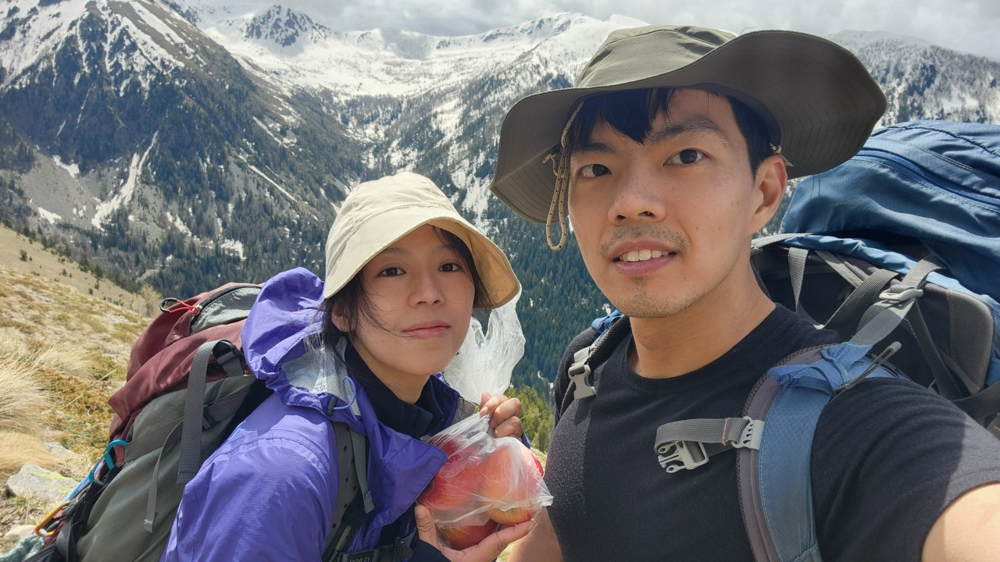
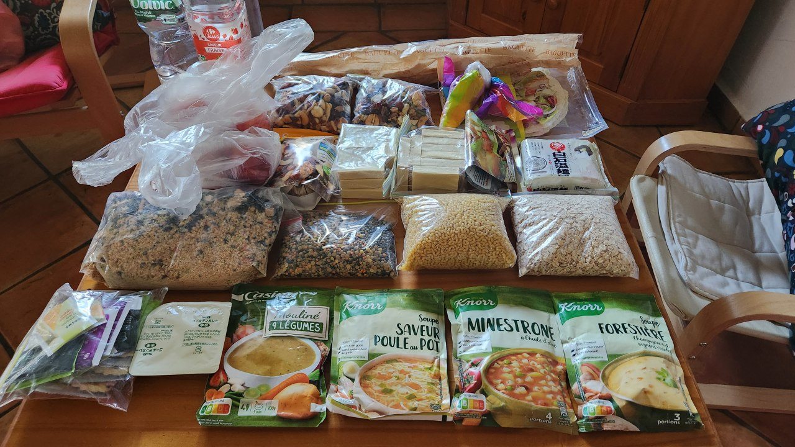
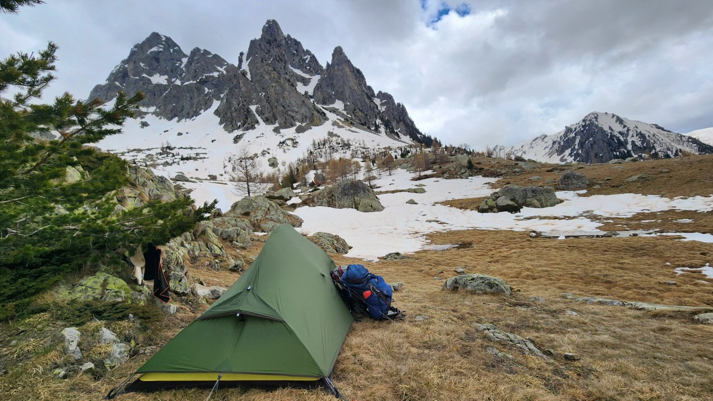
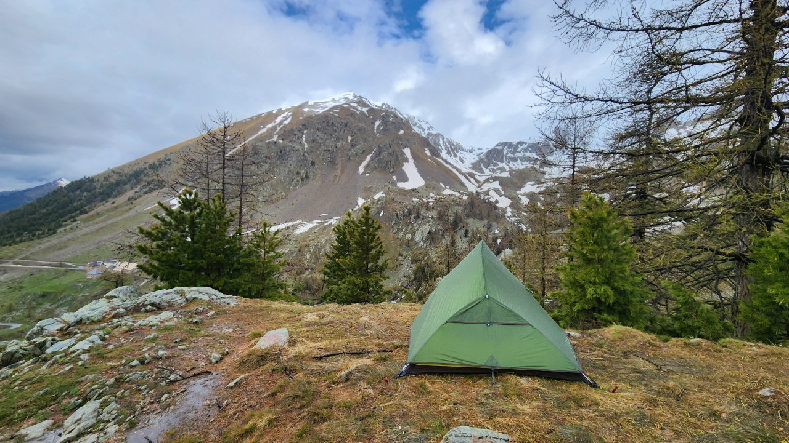

# 2024 May: Amsterdam, Netherlands & Nice, France

Sightseeing, attempt at GR52 & adventure sports from 7-19 May 2024.

<!-- more -->

## 7-11 May: Amsterdam Experience

**07 May (Tue)**

- 2340: Flight to AMS

**08 May (Wed)**

- Rushed transit at Frankfurt, Germany
- 0900: Arrive in AMS
- Debated on optimal way to Keukenhof and ended up buying transport & entry tickets online
- Botanic gardens was disappointing as most of the tulips were gone
- Chanel lost Nicholas' handmade portable charger zip pouch
- Hopped on the bus to Amsterdam City
- Had Kebab, pizza, greek bowl and a cinnammon bun
- Took the train to Abcoube but did not not check out and was charged EUR20 on our debit cards
- Rented bicycles from Ollie's cafe and went grocery shopping
- Chanel found the bicycle too high and changed for a more reasonable one
- Cycled along the river to the farm house.
- Nicholas went back out to get soap but came back with apple pie.
- Overnight at Airbnb: Maria's farm Abcoude cottage

**09 May (Thu)**

- Cycled and crossed the river with a DIY crossing boat
- Visited another town to do more grocery shopping
- Cooked steak, mushrooms and tomato ravioli for lunch before  relaxing in the afternoon
- Overnight at Airbnb: Maria's farm Abcoude cottage

**10 May (Fri)**

- Cooked chicken and apple pie for breakfast
- Went out for a short morning walk to take photos of the windmill
- Explored Abcoube town and had coffee at Ollie's cafe
- Took the bus/train to Amsterdam City
- Visited a candy shop and had fish and chips
- Nicholas waited for Chanel while she went off to shop around
- Took the crowded Tram 2 and attempted to enter the museum but it was fully booked
- Caught the bus to the airport
- 1920-2135: Flight to Nice 
- Overnight in Campanile Nice Aeroport

**11 May (Sat)**

- Downloaded the transport app and purchased tickets
- Left our bags at the hotel and headed to Nice City
- Visited the Saturday Market at Cours Saleya with our heavy bag of non-hiking items
- Ate pastries, strawberries and croissant in the area
- Missed the bus and had to walk back to take the tram to the hotel to drop off our bags
- Nicholas bought a pokebowl while Chanel tried to get train tickets to Monaco
- The train was crowded on the way to Monaco
- Nicholas ate his pokebowl while Chanel tried to figure out the way to the casino and shops
- Ended up walking back and forth and through the station and more to the shops
- Failed to reach the casino due to many obstacles from the Grand Prix but managed to procure bag
- Returned back to Nice to buy a luggage to store the purchased bag
- Chanel wente to the hotel to drop off the bag to a very unhappy reception while Nicholas went to buy the gas canister
- We quickly did our grocery shopping, buying water, pasta, baguette, soup bases, fruits and sunblock.
- Caught the tram 2 and ran to our hotel to pick up our hiking bags before making our way to Grand Arenas.
- Took bus 90 to Saint Martin Vesubie.
- Visited the Casino Supermarket which closes at 7 before cooking dinner.
- Overnight at Rez de jardin de chalet bois, a lovely wooden cottage.

## 12 - 16 May: GR52 Hike

**12 May (Sun)**

- Took a stock take of our food supplies
- Cooked lentils soup for breakfast and prepared ham and cheese wraps for the hike
- Had a short stop for tea and wraps
- Attempted to make tea from snow in the middle of the rain when Chanel got really cold
- Checked out the nearby refuge which was unfortunately closed
- Set up tent and cooked mushroom soup with baguette for dinner
- Overnight at tent

**13 May (Mon)**

- Cooked macaroni chicken noodle soup for breakfast
- Headed down the mountain to La Madone de Fenestre, where we saw many alpine ibex
- Attempted to reach Refuge de Nice but there was too much snow
- Went back down to set up tent by some rocks and trees
- Nicholas went to retrieve water from the stream while Chanel went out to search for data
- Cooked tomato tofu lentils macaroni soup for dinner
- Planned a new route to Saint Grat to get to our accomodations
- Overnight at tent

**14 May (Tue)**

- Chanel woke up to cook but could not get the stove working
- Nicholas fixed it and we had warm oats with nuts for breakfast
- Returned back to La Madone de Fenestre and up again
- Crossed many snow fields and stream
- Encountered a huge snow slope which we were determined to climb over
- With just a mere 3 metre to what look like the top, we could not go further as the snow was too thick and soft and we keep slipping over
- Wth a heavy heart, we turned back for safety reasons
- Set up tent and hid inside watching Buffy the Vampire Slayer while it rained outside
- Overnight at tent

**15 May (Wed)**

- Cooked somen for breakfast which could not be cooked for lunch
- Attempted to hike a trail back to Saint Martin Vesubie
- Crossed a huge waterfall and many snow paths
- Decided to use the easy road path as the trail up the mountain may be covered in snow again
- It was an easy walk down the road path until we encounter the landslides which destroyed the road
- Ending up at the road side of the river, we followed the river in hopes of finding a crossing.
- We used a dam control station to get across after much walking over rocks.
- We booked another accommodation in town and bought more groceries.
- We washed our clothes and attempted a full-scale drying operation.
- Overnight at Hotel Charment 2 pieces duex au mercantour

**16 May (Thu)**

- Headed out in the rain to catch bus 90 to Nice.
- Attempted to check in to the hotel at 1pm but was rejected.
- Left our hiking bags and went shopping in the city.
- We had some atas seafood and lovely sorbet ice cream.
- Chanel bought soap bars, bag and clothes. Nicholas bought music box and a poker chip.
- Overnight at Hotel So’Co by Happyculture 

# 17 - 19 May: Water Rat's Adventures

**17 May (Fri)**

- Headed out to have breakfast at a cafe where Nicholas chose a weird fish cake
- Chanel got distracted by cosmetics
- Caught the tram and walked a long way to the car rental shop
- Drove to Castellene and had a water rafting experience down Verdon Gorge
- Had some good dinner at the town before buying steak and chicken
- Overnight at Airbnb Chateauvieux

**18 May (Sat)**

- Paragliding @ Saint André les Alpes (EUR130)
- Chanel drove to grocery and fruits shopping
- Had a short evening walk around the town
- Overnight at Airbnb Chateauvieux

**19 May (Sun)**

- Omelettes, potatoes, chicken and legumes macaroni soup for breakfast
- Fruits on the car ride down to Primark for shopping and really good pokebowl
- Search for grocery stores for souvenirs
- Refuelled the car at the wrong petrol station
- Returned the car and took the shuttle to the airport
- 2000: Delayed Flight to Zuriich
- Transited at Zurich, Switzerland where Chanel was so hungry, she bought 3 for 1 croissants which was not good
- 2240: Flight to Singapore with many empty seats and we get to lay down to sleep

**20 May (Mon)**

- 1635: Arrive in SIN

# Costs

Total Amount: SGD 6127.26 
- Accoms: 1402.62 (22.88%)
- Activities: 734.48 (11.99%)
- Car: 338.16 (5.52%)
- Flights: 2403 (39.22%)
- Insurance: 134.66 (2.20%)
- Food/Shopping: 1114.34 (18.19%)

Approximate total cost per person: **SGD 3063.63**

# Packing List

| Items | Chanel | Nicholas |
|--------------|-------|--------|
| **CLOTHES**  |       |        |
| Hat          |   x   |   x    |
| Buff         |   x   |   x    |
| Sunglasses   |       |   x    |
| Outershell   |   x   |   x    |
| Down Jacket (in waterproof bag) | x | x |
| Wool baselayer (long sleeve/t-shirt) - at least 2 pairs | x | x |
| Outershell pants/hiking pants | x | x |
| Baselayer (pants) | x | x |
| City/airport wear | x |   |
| Sleepwear | x | x |
| Wool socks - at least 2 pairs | x | x |
| Swimsuit | x | x |
| Long sleeve swimming shirt | x | x |
| Hiking Shoes | x | x |
| **CAMPING** |       |        |
| Backpack (>=65L) | x | x |
| Sleeping bag (in waterproof bag) | x | x |
| Sleeping bag liner |   | x |
| Tent |   |   |
| Tent ground sheet |   |   |
| Bag raincover | x | x |
| Headlamp + batteries | x | x |
| Foam mat | x | x |
| Swiss army knife |   |   |
| Carabiner | x | x |
| Camping wowel |   |   |
| **COOKING** |       |        |
| Food (see below) |   |   |
| Stove/pot/utensils |   | x |
| Aqua tabs |   | x |
| Sponge/steel scrubber |   | x |
| Detergent |   | x |
| Cheesecloth (to pre-filter water) | x |   |
| 2L Bottle |   | x |
| 1L Bottle | x | x |
| 2L PET Bottle Fuel |   |   |
| **HYGIENE** |       |        |
| Toothbrush/shaver/foam | x |   |
| Toothpaste | x |   |
| Hand sanitizer |   | x |
| Toilet Paper |   | x |
| Biffy bag X5 |   | x |
| Body wipes | x |   |
| Small metal cup (to make brushing teeth easier) |   | x |
| Plastic bags/large ziploc for dirty clothes, trash, food |   | x |
| **ESSENTIALS** |       |        |
| Passport | x |   |
| Phone |   |   |
| Travel adapter + Cable | x | x |
| Powerbank | x | x |
| International Driving License | x | x |
| SIM cards | x |   |
| Spectacles/ spectacles case | x |   |
| Panadol/charcoal/azithromycin/plasters |   | x |
| GPX Trails | x |   |
| Sunscreen | x |   |
| Lip balm | x | x |
| Moisturizers | x |   |
| Kindle/Kobo |   |   |
| Ear plugs/ eye mask |   | x |
| Wireless Earbuds |   |   |
| **OPTIONALS** |       |        |
| Poker cards |   |   |
| Paper/pencil Use poker app instead |   |   |
| App to track poker | x |   |
| Laptop + Mouse |   |   |
| Crocs | x |   |
| Movies |   | x |
