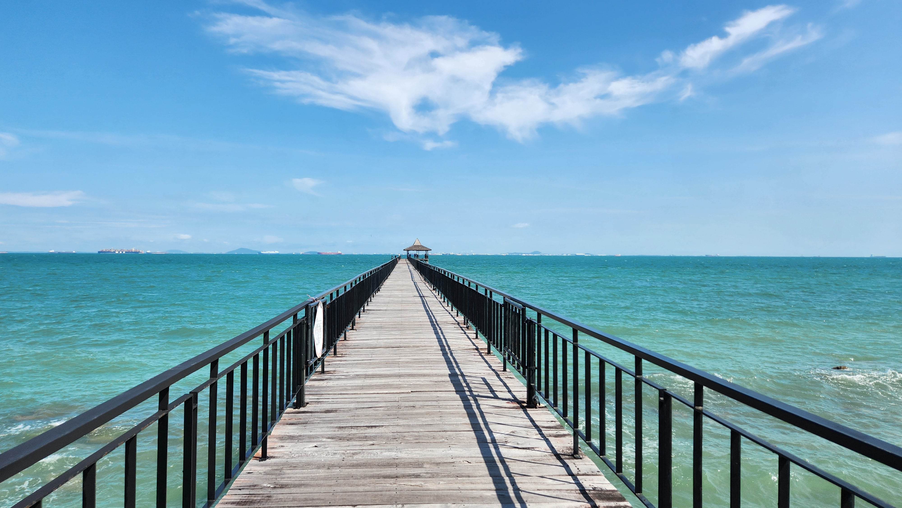

# 2024 Dec: Batam

A last minute getaway in Batam.

<!-- more -->

## Itinerary

Western Indonesian Time (WIB): UTC+07:00 (1 hour behind Singapore)

**7 Dec, Sat**

-   1045: Ferry from Harbourfront to Harbour Bay (Nagoya Area)
-   1200: Eat @ Fat Boy Club, Nagoya Love Seafood, JOYI BAKES, Spice Restaurant
-   1500: Check-in, Sea Creatures Hunting and Swimming
-   1900-2100: BBQ Dinner with Live Music, _Nicholas missed his chance to sing 勇气_
-   Overnight @ Turi Beach Resort

**8 Dec, Sun**

-   0800: Breakfast & Jetty Walk
-   1100: Gaming @ Factorio
-   1200: Checkout, _Nicholas left his $200+ earbuds in the room's safe and we got the Grab driver to turnaround to retrieve it_
-   1400: Explore @ Bhinneki, Grand Batam Mall, A2 Food Court, Kueh Lapis
-   1630: Steamed Fish & Roti-O @ Harbour Bay Ferry Terminal
-   1830: Ferry back to SG

## Total Cost - SGD260 per pax

-   Transport ~$90 (inclusive of Ferry and Grab)
-   Hotel ~ $85
-   Food & Shopping ~ $85

## Reviews

**Chanel's Review 7/10**

The best of the trip include the beach and live music. The weather was exceptional on day one and the beach resort was good. However, the food was disappointing and more expensive that expected. However, there were a few stand outs which was the Bingsoo and the steamed fish at Harbour Bay Ferry Terminal. Overall, I would only recommend Batam for last minute booking. If one is looking for a beach vacation, I would rather go Cebu or somewhere with good beaches.

**Nicholas' Review 7/10**

The Indonesian people are very welcoming and polite, and the pace of life is indeed slower there. I wonder whether introducing technology to the island will actually benefit the people living there. Maybe they've adapted nicely to their island lifestyle, and technology will simply ruin everything there? Seeing the beach is nice in itself and reminds me of the beach holidays I used to have in the past with my family. The sand, waves, sun combine to melt troubles away in a strange way. At night it is almost ethereal sometimes. I think I have a mild lack of sleep which I need to fix over the next few days.

The food at the resort could be improved. There were no jellyfish to be seen. The price of the trip was very reasonable, and the whole trip was smooth without any hiccups/delays.
