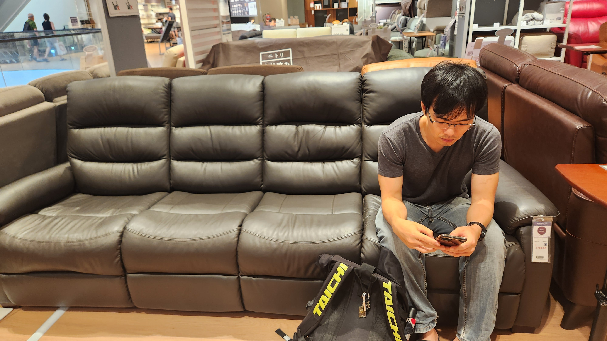
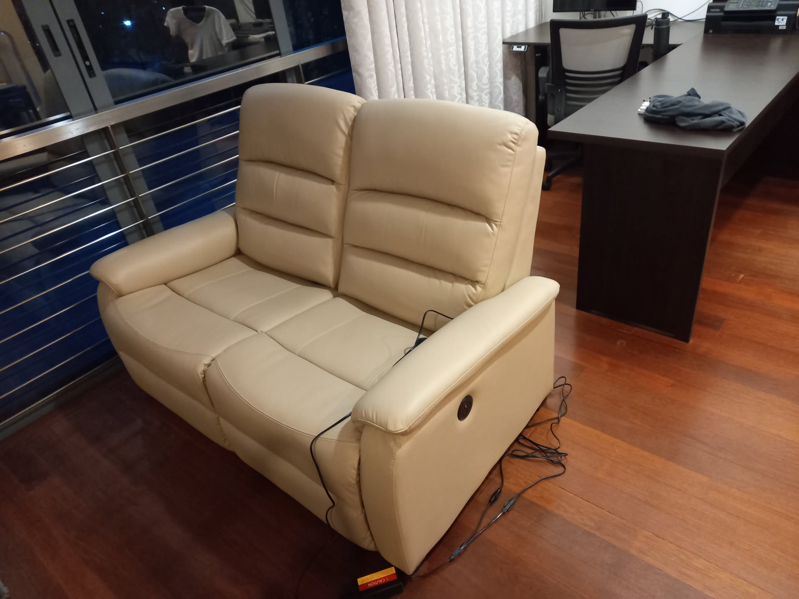

# Sofa

After the mattress, we decided to get a sofa.

<!-- more -->

## Requirements

-   Dimension: W: 140cm, D: 80cm, WS: 80cm
-   Material: Leather
-   Budget: < SGD1.5k
-   Funtionality: A full recliner with electric operation is preferred to allow for the full range of recline

## Options

1.  [Bean Bag][bean-bag] (Hipvan), $300

    -   Cheap and fits dimensions. However, there was no display piece for testing.

2.  [Leather with latex, L:130cm][leather-latex] (Taobao), $600

    -   Nicholas likes latex and it was reasonably priced. However, it is an online purchase and cannot be tested. Furthermore, it has to be shipped from China. Being a large piece of furniture, the shipping cost could be almost the same price as the sofa.

3.  [2S-SOFA MK02-HD KD N-SHIELD BK][nitori-sofa] (Nittori), $399

    -   This was our first choice as it was cheap and fits our dimensions and required material. Furthermore, the Japanese brand is assumed to be reliable and of quality. However, upon testing various sofa at the outlet, we found them to be not very comfortable and Nicholas decided that there is a need for recliner function.

4.  [Univonna Javier][univonna-javier] (Lazada), $615 (Manual), $915 (Motor)

    -   Chanel chanced upon their recliners on Lazada and found their physical shop at TradeHub. We visited the outlet on 9 Jan 2024 and met an aggressive salesman. The recliners were comfortable and decently priced. However, we could only afford the manual recliners given our budget and Nicholas did not manage to try it out as he was sweaty from running.

5.  [SOLOTTI MARTINA HALF LEATHER 2 SEATER RECLINER SOFA (BLACK)][solotti-martina] (Courts), $599

    -   Chanel found this cheap recliner sofa online at Courts and they had a piece to try out at Tampines. We found a similar piece at Courts Orchard and found it to be abit too hard.

6.  [DRESDEN FULL LEATHER 2 SEATER RECLINER SOFA (DARK MOCHA)][dresden-sofa] (Courts), $1649

    -   We found this very comfortable recliner sofa. The material was really good. However, it was pricey and a manual half-recline.

7.  [TWIN-MOTOR 2S-SOFA UM01 DGY][twin-motor-sofa] (Nittori), $1299

    -   This was the first sofa we saw at Nitori (earlier, we thought they did not have any). Nicholas felt it was not very comfortable on initial seating, despite having 2 adjustable parts: headrest and tilt.

8.  [2 SEAT RECLINER SOFA N-BELIEVA BE2-MI15 LEATHER][nitori-recliner] (Nittori), $1199

    -   This was the second sofa we saw at Nitori. It was an electric recliner sofa. It was very comfortable on initial seating, and also on full tilt.

We purchased the Nitori 2-seater [N-BELIEVA BE2-MI15 LEATHER][nitori-recliner] sofa on 11 January 2025.

Considerations:
1. **Comfort**: Chanel found the UM01 more comfortable as it suits her short legs and felt that the ability to adjust the headrest was a big winner. However, Nicholas convinced Chanel that putting a pillow at the back would resolve the comfort.
2. **Durability**: Between the N-shield PVC and the leather, the salesman recommended leather as it will last longer. Hence, we topped up $100 for leather. Thick leather was abit too sticky for our liking and the additional $400 for it was not worth it.
3. **Appearance**: Chanel found the UM01 better looking as there was less lines/sections. However, Nicholas convinced Chanel that it was because of the display piece colours and the lighting at the pieces(Nbelieva-brown, UM01-ivory) which made the lighter/UM01 colour pieces look better. Chanel concurred and decided to get beige for Nbelieva then since they did not have black and the brown (display piece) is a ugly brown (see picture above).
4. **Time to deliver**:
    - N-believa Leather Beige - 25 Jan (Delayed)
    - N-believa Thick Leather Brown - Early Feb
    - N-believa Nshield Black - Early Feb
    - N-believa Leather Brown - 4 March
    - UM01 Dark Grey - 11 March

[bean-bag]: https://www.hipvan.com/products/bowen-bean-bag-sofa
[leather-latex]: https://e.tb.cn/h.T7viWG1onqvLL8w?tk=wAJcebjcEKe
[nitori-sofa]: https://www.nitori.com.sg/collections/2seater-sofas/products/2s-sofa-mk02-hd-kd-n-shield-bk
[univonna-javier]: https://www.lazada.sg/products/univona-javier-2-seater-recliner-sofa-synthetic-leather-free-delivery-free-assembly-i6366730-s21045137676.html?
[solotti-martina]: https://www.courts.com.sg/solotti-martina-2rr-m-seater-hl-black-half-leather-sofa-ip184630
[dresden-sofa]: https://www.courts.com.sg/dresden-2rr-seater-fl-dk-mocha-full-leather-recliner-sofa-ip180785
[twin-motor-sofa]: https://www.nitori.com.sg/products/twin-motor-2s-sofa-um01-dgy
[nitori-recliner]: https://www.nitori.com.sg/products/2-seat-recliner-sofa-n-believa-be2-mi15-leather
