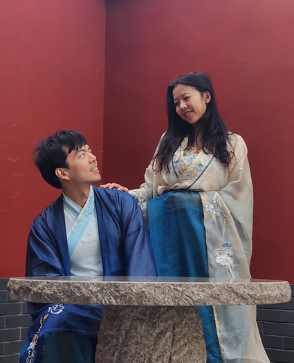

# 2025 Apr-May: Chengdu, Sichuan, China

China Experience, Tang Dynasty Wedding and Minya Konka hiking from 25 Apr-6 May 2025.

<!-- more -->

## 25 - 27 Apr: Pandas & Tang Dynasty Wedding

**25 Apr (Fri)**

-   1600-2025: Flight to TFU
-   Tooked the airport express bus to Chunxi IFS (SGD3/pax, 1 hour)
-   Walked to Echeng Hotel in the drizzle with our luggage
-   Overnight at Echeng Hotel (Chengdu Chunxi Road Taikoo Li Branch) (SGD70)
-
**26 Apr (Sat)**

-   Woke up and decided to visit Panda Base
-   Didi to the South Entrance and got bombarded with panda clutching touts
-   Queued 45minutes for 15 minutes of Hua Hua Panda viewing
-   Had skewers and sweet duck with Ya Rui & Theron
-   Rented Hanfu and walked Jinli Street
-   Ate Kaoyu at IFS (SGD40)
-   Overnight at Echeng Hotel (Chengdu Chunxi Road Taikoo Li Branch) (SGD70)

**27 Apr (Sun)**

  <figure style="max-width:300px">
    
  </figure>

  <figure style="max-width:300px">
    
  </figure>

-   0900: Didi to Furong Garden to see Sky's arrival by horse and carriage.
-   Played mahjong and bought bubble tea
-   Experienced Sky's & Hengzai's Tang Dynasty-style wedding - significant food wastage
-   Returned to town to buy gas from Decathlon but it was not sold
-   Borrowed the hotel's meituan phone number to have gas and cooking pots delivered
-   Returned the hanfu and didi backed to Furong Garden for Sky's & Hengzai western-style wedding and live band
-   Overnight at Echeng Hotel (Chengdu Chunxi Road Taikoo Li Branch) (SGD70)

## 28 Apr - 2 May: Kangding Tibetian Culture Experience

**28 Apr (Mon)**
-   1020: Bus to Kangding (SGD25/pax)
-   Nicholas really needed to go to the toilet and was in great danger but he was saved by bread bag and water throw out of window by a helpful temple monk person.
-   Ate corn and bought a hat at the highway stopover.
-   Got touted to take 30CNY/pax to Xinduqiao. Nicholas was afraid of being scammed until a cute kid entered the van.
-   Got dropped off early to our hotel and walked to town to book a private tour.
-   Bought snacks and ate beef stew at the hotel.
-   Overnight at Lan Au Shangpin Hotel (Kangding Xinduqiao Branch) by 3300m (SGD54)

**29 Apr (Tue)**

-   0800-1200: Private car tour to Yuzixi, Gedilaram Sky City and Sidingcuo lake. (SGD140)
-   Got abandoned by private tour guide to the transport van to return to Kangding.
-   Walked around Kangding city and found a hiking shop and cream puffs.
-   Ate Tibetian and handmade noodles.
-   Purchased return bus tickets to Chengdu and found contacts for next day's transport to Laoyulin.
-   Chanel gave up The mountain is the mountain for nearby hotel that gave disposable towels
-   Overnight at Yunzhi Hotel by 2600m ($35)

**30 Apr (Wed)**

-   Had porridge, egg and steamed buns for breakfast
-   Arranged 930am transport to Gexi Grassland and met two other Chinese Hikers (SGD35)
-   Was dropped off 1km away from the starting point and walked through mud fields
-   The weather was much warmer than the previous 2 days and the sun was out.
-   Cooked lentils soup for breakfast and prepared ham and cheese wraps for the hike
-   Nicholas took the burden of carrying the water bottles
-   Arrived at Liangcha campsite at 5pm and set up tent
-   Cooked Corn soup with macaroni and bread for dinner
-   Nicholas went to the stream to retrieved unclean water
-   Overnight at Liangcha 3900m

**1 May (Thu)**

-   Bread was eaten by horse
-   Cooked lentils for breakfast
-   Headed up the mountain and saw Xiao Gonga, motorcyclists and a dead yak
-   Nicholas helped pushed mountain biker who was stuck even though he was not feeling well
-   After setting up tent at 3pm, Nicholas collapsed and rested
-   We had egg fried rice and cup noodles for dinner
-   Our campsite was invaded by many other hikers at 6pm. There was a lot of people.
-   We considered taking the horse down and escape the place.
-   Overnight at Upper Riwuqi by 4300m

**2 May (Fri)**

-   Nicholas woke up not so well and took medicine
-   Cooked Bakuteh somen noodles which became gooey for breakfast
-   Headed down the mountain and stopped at Liangcha to find horses.
-   There was no more horses and we had to trudge our way down the mountain.
-   Met Liu who entertained Nicholas and exchanged Weixin.
-   Found transport to Kangding at 4pm. (SGD30)
-   Brought forward our return bus ticket to Chengdu.
-   Overnight at 7 Days Premium Kangding. (SGD90)

## 3 - 6 May: Chengdu Tea & Bian Lian Experience

**3 May (Sat)**

-   Had noodles and steamed buns across the street for breakfast
-   Boarded the bus back to Chengdu. (SGD20/pax)
-   Contemplated many hotels and checked out a gaming-smoking hotel.
-   Walked around Tianfu Square, People's Park and Kuanzhai Alley.
-   Had really good tea and fantastic Bian Lian show at Heming Tea House.
-   Purchase souvenirs and the super crowded Kuanzhai Alley.
-   Had hotpot for dinner before returning back to the hotel.
-   Overnight at HAZENS Hotels Chengdu Chunxi Road Tianfu Square. The aircon was not working well and the room was hot. (SGD115)

**4 May (Sun)**

-   Considered going to Jiuzhaigou due to Chanel's father.
-   Chanel took a morning walk and bought clothes and breakfast back.
-   Had tofu dandan mian and Shuyi Grass Jelly bubble tea.
-   Chanel booked train tickets for Jiuzhaigou at 5pm.
-   We dropped off out bags at the hotel next to Chengdu East Railway Station before going to the Wukuaishi Wholesale Tea and bought tea.
-   Chanel delayed the return to the train station and we missed our train (SGD70). We got a refund for the return train.
-   Had roasted pork and duck for dinner before visiting a very cool mall.
-   Overnight at Echeng Hotel (Chengdu Chunxi Road Taikoo Li Branch) (SGD75)

**5 May (Mon)**

-   We meituan breakfast and bubble tea and did laundry
-   Chanel took a noon walk and bought necklace and Taolin back.
-   We revisited Tianfu Square and People's Park and met a English-speaking chinese who recommended some food places.
-   2000: Shufeng Opera House Bian Lian Performance (SGD33/pax)
-   Nicholas purchased squeaking panda and we meituan-ed skewers for dinner
-   Overnight at Echeng Hotel (Chengdu Chunxi Road Taikoo Li Branch) (SGD75)

**6 May (Tue)**

-   We meituan breakfast and took didi (SGD40) to airport
-   1000-1500: Flight to SIN
-

## Costs

Total Amount: SGD 3123.60

-   Flights: 940.00 (30%)
-   Food/Shopping: 937.74 (30%)
-   Accoms: 654.66 (21%)
-   Activities: 265.90 (9%)
-   Transport: 201.00 (6%)
-   Insurance: 124.30 (4%)

Approximate total cost per person: **SGD 1561.80**
