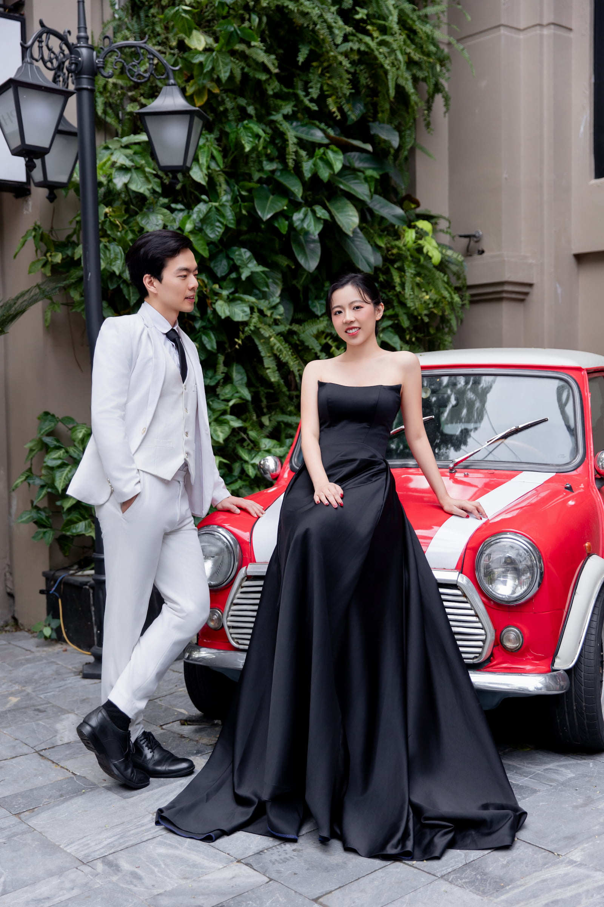

# 2025 Nov-Dec: Da Nang & Hoi An, Central Vietnam

Wedding Photoshoot and Tailoring Experience from 29 Nov-5 Dec 2025.

<!-- more -->

**29 Nov (Sat)**

-   1115 - 1305 SIN T4 - DAD via Vietjet, JPVAM3
-   Our flight was shifted from evening to morning, hence, we rescheduled the second day of our marriage course. It was a good change as it gave us more time in Hoi An.
-   We arranged a last minute transport with our hotel for 300k VND. The landing was delayed due to traffic on the ground but overall, the Vietjet flight was comfortable and smooth. We should bring a bottle of water the next time we take a budget plane.
-   We had Banh Mi from Banh Mi Phurong, Cao Lao from Mr Hai Noodles, White Rose/ Tacos from Miss Ly before having the best bubble tea (in Hoi An) from LaSiMi.
-   For tailors, we visited Vanda, Yaly, Bari, Blue Eye and Tuong.
-   At Tuong, Nicholas decided on a 2-pc blue suit + 1 shirt (7,135k VND). Chanel was disappointed at the lack of good blues at Tuong. Chanel decided to get a dress (3,164k VND) from Tuong based on fomo/ and the lower quoted price. She felt some regret on not choosing a more unique style.
-   We returned to Blue Eye as Chanel insisted that Nicholas get a slightly shiny 3-pc black suit + 2 shirts (7,420k VND) from there. She also got a 2-pc suit set + shirt (5,432k VND) for herself. Full payment upfront.
-   Overnight at Hoi An Em's House Hoi An Homestay (768k VND) - Nicholas slept well with the soundproof room. Of note the windows of the door-type (non-sliding) which made for better soundproofing.

**30 Nov (Sun)**

-   Woke up and headed the other direction for breakfast at Cam Coffee. We had egg coffee, coconut cream coffee (nice) and an American breakfast set.
-   Nicholas purchased 2 leather shoes from Hello Leather at 2,400k VND (deposit 1,200k VND). The shop was run by a couple.
-   Chanel did nails at Tiffany while Nicholas went around to find if we can get a good quote for a custom leather laptop bag (we did not).
-   We checked out the hotel at 12pm and went for our second fittings. Nicholas found out that the pants was quite hard to sit.
-   On the way back, we went to Bari and bought 3 shirts because the lady was quite nice and Chanel wanted linen shirts. They were 40 USD each.
-   We headed back to the hotel to take the car back to Da Nang. Nicholas made a detour to check if the shoe shop could use rubber soles instead of wooden soles for his shoes, but they were already in the process of being made.
-   We had some tea after checking in at our hotel and headed to the Tuart studio where we were attended by Kim Kanh.
-   Chanel tried on many, many dresses (more than Singapore would allow) and Nicholas tried on some suits. We decided on the three locations for our photoshoot.
-   We walked back to the hotel and had more noodles.
-   Overnight at Sanouva Da Nang Hotel ($65) - Nicholas did not sleep well due to the arguing Korean couple next door/too much coffee. Chanel slept slightly less well.

**1 Dec (Mon)**

  <figure style="max-width:300px">
    
  </figure>
  <figure style="max-width:300px">
    
  </figure>

-   0430: We woke up and the make up artist Thu arrived to give Chanel Korean make up, lashes and pretty hairstyles
-   0700: The photographer Thuc and helper Huy arrived and we started taking photos at the hotel lobby.
-   It was raining so we could not go to the beach. Hence, we had breakfast first at an authentic Vietnam place in our gowns/suits.
-   The beach photos were nice but it started raining so we took shelter and saw baby crabs together with the photographer.
-   As the rain was not stopping, we headed to the studio for more photos and Chanel was tired but the make up artist was super positive and encouraging.
-   After the studio, they even allowed us to go back to the beach for more photos as the rain stopped. We return to Tuart to have our makeup removed.
-   While waiting for the photos to be downloaded, we went back to the hotel to change and drop our things.
-   We chose 35 photos to be edited - we could have chosen more landscape photos in hindsight and perhaps the first dress and last dress was not really to Chanel's liking.
-   We took Grab to Han Market and bought dried mangoes and Chanel almost got scammed by an ao dai seller but utilized her assertiveness to get her money back by herself (without Nicholas intervening). She found another ao dai seller and Nicholas found 4 shirts.
-   We had a seafood at LoCo but they forgot the octopus and the next table had a runaway crab but he was captured, washed and retuned to the hot tub. Nicholas was traumatized at watching the crab and his friend get cooked.
-   Overnight at Sanouva Da Nang Hotel ($69)

**2 Dec (Tue)**

-   Breakfast at the hotel before taking grab back to Hoi An.
-   It was raining heavily when we went for our 3rd fitting, Chanel requested for bra pads for the dress from Tuong and demanded that Blue Eye correct the shiny satin of Nicholas' Tuxedo.
-   At Bari, we bought another suit (SGD 123) and Chanel got another pants (USD 50) and linen shirt (USD38) made.
-   We walked back to the hotel and got picked up for our cooking and coconut tour. We visited the market and cooked 5 dishes under excellent instruction including a flambe demonstration with just water, before going on a nice evening coconut boat tour. We did not catch any crabs. Chanel thought Nicholas was retarded as he kept saying 'Coconut' and laughed as a result.
-   Within 5 hours, Blue Eye fixed all our suits and we collected them. We also did another fitting at Bari and Chanel bought another grey pants. Tuong was closed by the time we walked there so we decided to collect it the next day instead.
-   We walked around the streets of Hoi An before heading back to try the Hello Leather shoes where the cobbler adjusted them on the fly, and then left Nicholas' broken black shoes for them to fix.
-   Overnight at Em's Homestay.

**3 Dec (Wed)**

-   We tried on the tailored clothes again and Chanel decided to go back to Blue Eye to get her shirt to fit better.
-   It was a rainy day and on the way there, we got some coffee and pistachio croissant (lots of cream) and Chanel found her pretty linen dress in the store opposite the cafe for VND 1,000k.
-   We did another fitting at Bari and arranged to come back at 1pm to collect. We also collected our Tuong clothes.
-   We had chicken rice at Ba Buoi (the wasabi vegetables were nice) and bought more bubble tea and croissant taiyaki.
-   We had Morning Glory for lunch (grilled squid in some sambal sauce was nice, chicken pho less so) and bought 3 bubble teas back to our next hotel.
-   We did an evening beach walk and Chanel did body scrub while Nicholas ordered Bikini Bottom Burgers using Grab.
-   The repaired shoes was also delivered to our hotel.
-   Overnight at Wyndham Hoi An Royal Beachfront Resort & Villas (SGD 103)

**4 Dec (Thu)**

-   Chanel wanted to take more beach photos since its no longer raining so we dressed up.
-   Instead of taking pictures, we decided to alter dresses and shirts so we took the 9am shuttle bus back to Hoi An.
-   Chanel bought another linen dress but with pocket this time and Nicholas went back to Bari to loosen the shirts. There was no issue with the Tuong Dress after all - it might be some zipping issue.
-   On the way back, we decided to get Elizabeth's bag custom made and was being sold to by the Friendly Shoe Shop Owner.
-   It was past 12 when we reach the hotel and our card was not working but the receptionist fixed it. We took a grab back to Da Nang.
-   At Da Nang, we visited the GO! Supermarket where Nicholas bought 2 dragon fruit and had his bag sealed. We then went to the studio to collect our nicely packed and wrapped photos and returned to the hotel where Nicholas took care of the toilet.
-   We took more photos at the beach. Chanel wore her pretty white dress and was smiling/beaming very much as Nicholas took photos of her in a similar style to the Australia beach one on her Telegram.
-   We took a leisurely 1-hour walk to All Seasons Seafood Buffet, enjoying the scenery, beach and general city vibe on the way with many seafood restaurants and tanks full of sea creatures ready to become food. Chanel got angry at the waiter for not bringing her chilled prawns. We bought Shuyi grass jelly bubble tea and headed back.
-   Chanel thought Nicholas was being a washing machine at night which she found funny.
-   Overnight at Le Sands Oceanfront Danang Hotel (SGD 71)

**5 Dec (Fri)**

-   We had breakfast at the hotel on a nice window facing the beach, and coffee at a Jollybee-owned franchise at the airport. There was a cool crowd/people detector dashboard at the airport as well, presumably working via an overhead camera.
-   1150 - 1550 DAD T2 - SIN via SQ171, EIPAWU

## Overall Trip Expenses

| Category  | Nicholas (SGD) | Chanel (SGD) |
| --------- | -------------- | ------------ |
| Shared    | 1,122          | 1,122        |
| Personal  | 1,272          | 974          |
| **Total** | **2,394**      | **2,096**    |

??? note "Shared Expenses"

    | Item                           | Nicholas (SGD) | Chanel (SGD) |
    | ------------------------------ | -------------- | ------------ |
    | Tuart Wedding Photoshoot       | 383            | 383          |
    | Flights (inclusive of Baggage) | 262            | 262          |
    | Food, Souvenirs and Transport  | 236            | 236          |
    | Hotels                         | 195            | 195          |
    | Travel Insurance               | 24             | 24           |
    | Coconut Boat Tour              | 22             | 22           |
    | **Total**                      | **1,122**      | **1,122**    |

??? note "Personal Expenses"

    | Nicholas’ Item                      | Price (SGD) | Chanel’s Item           | Price (SGD) |
    | ----------------------------------- | ----------- | ----------------------- | ----------- |
    | Blue Eye 3 pc black suit + 2 shirts | 364         | Blue Eye suit + 1 shirt | 266         |
    | Tuong 2 pc blue suit + 1 shirt      | 350         | Tuong dress             | 155         |
    | Bari 2 pc beige suit                | 123         | Cosmetics               | 152         |
    | Friendly Shoe bag                   | 123         | Bari 2 pants            | 114         |
    | Hello Leather 2 shoes               | 118         | Bari 2 linen shirts     | 103         |
    | Bari 1 cotton shirt 1 linen shirt   | 103         | 2 linen dress           | 98          |
    | Bari alteration for 4 shirts        | 45          | Wine                    | 42          |
    | Shoe repair                         | 25          | Nails, spa              | 27          |
    | Tea cup set                         | 22          | Ao Dai                  | 17          |
    | **Total**                           | **1,272**   | **Total**               | **974**     |
