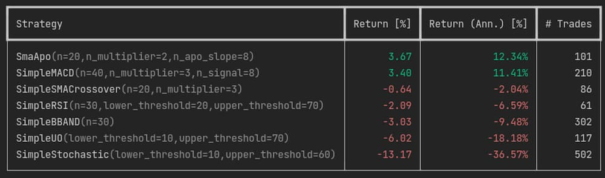

# Backtester

Run/optimize a strategy on test data, using [backtesting.py][backtesting.py].

Run `python -m backtester --help` for more info.

[backtesting.py]: https://kernc.github.io/backtesting.py/
