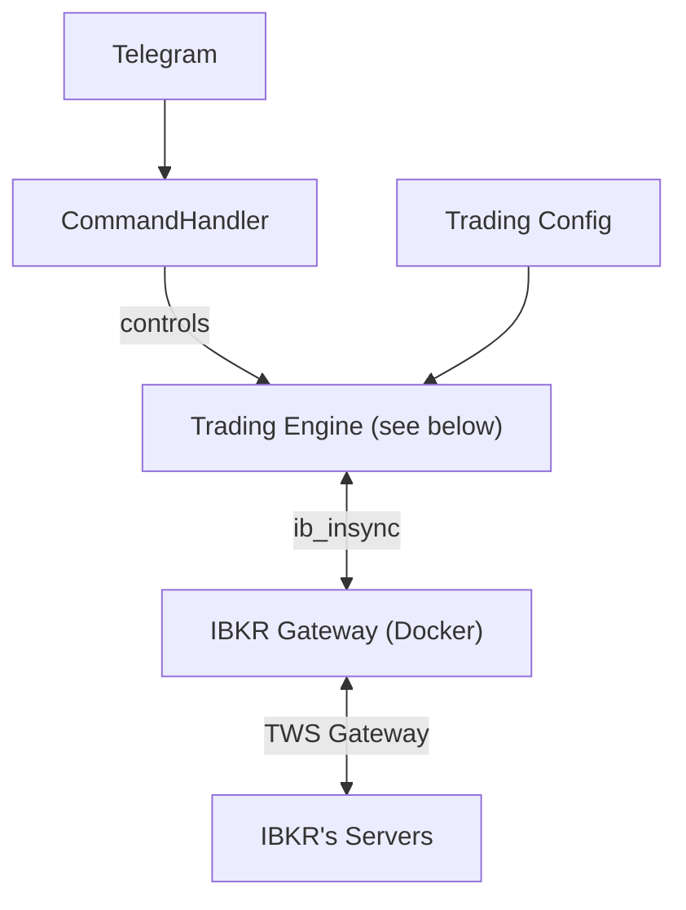
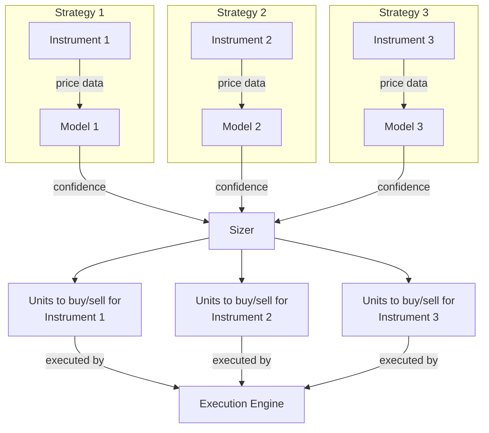
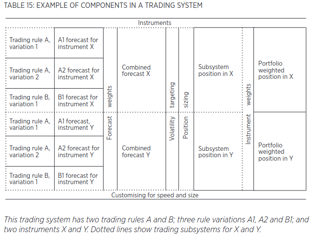

# Architecture

## Trading Engine

The Trading Engine is the heart of the bot, and receives market data, executes strategies, and performs trade executions.

A strategy can be combined with any instrument. The same model can operate on different instruments, e.g. `Model1` on `Instrument1` and `Model2` on `Instrument1`.

Adapted from [Systematic Trading][systematic-trading]:

[systematic-trading]: https://github.com/extrange/trading-bot/releases/download/trading-books/systematic-trading.pdf
