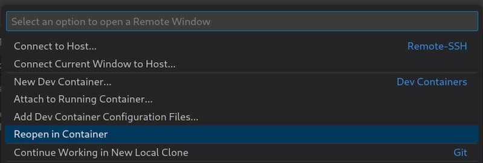

# Getting Started

First, clone the [repo]:

```bash
git clone https://github.com/extrange/trading-bot
```

Next, we'll need to configure the account credentials and other settings.

Create a `.env` file in the root directory and fill it with the following variables.

!!! note inline end ""

    For an explanation of each variable, see [here][env-variables].

```shell
# Values are omitted here, but you will need to fill them accordingly
USERNAME=
PASSWORD=
ACCOUNT=

PORT=
CHAT_ID=
TRADING_MODE=
UID=
GID=
```

Within VSCode, reopen the folder in the Dev Container:



Then, we can configure our Telegram bot. If you have not already created a Telegram bot, you can do so by messaging [@BotFather] on Telegram.

Run the following command and follow the instructions:

```bash
python -m setup-telegram
```

Finally, you can start the trading bot:

```bash
docker compose up
```

You should now be able to see IB Gateway on the browser at `localhost:<PORT>`, and both the terminal and your Telegram chat/group should start showing notifications.

[env-variables]: env-variables.md
[repo]: https://github.com/extrange/trading-bot
[@BotFather]: https://t.me/botfather