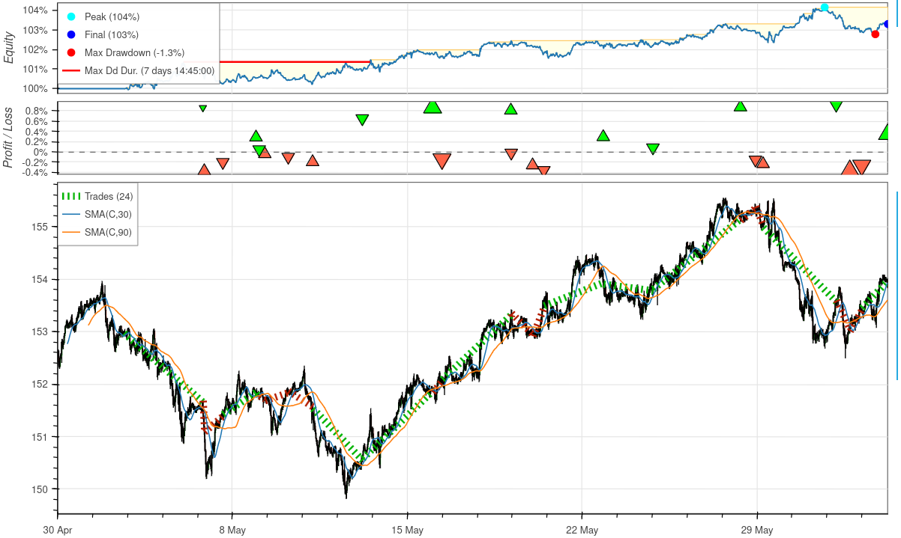
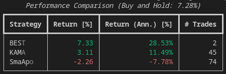
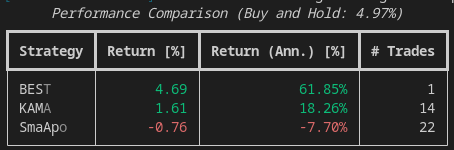

# Trading with CHFJPY 8 May - 21 Jul 2023

## Setting Up an IBKR T Reg Margin Account
- Under the Federal Reserve’s Regulation T, investors can borrow up to 50% of the purchase price of securities.
- Minimum deposit for IBKR T Reg Margin Account: 2,000 USD
- Transfer funds to the Fsegment in Account to satisfy maintenance margins.

## Contract For Difference
- A contract for differences (CFD) is a financial contract that pays the differences in the settlement price between the open and closing trades. There is no delivery of physical goods or securities with CFDs.
- There is no ownership of the underlying cost, there is no borrowing or shorting cost.
- CFDs are cash-settled but usually allow ample margin trading so that investors need only put up a small amount of the contract's notional payoff.

## [Commissions](https://www.interactivebrokers.co.uk/en/pricing/commissions-cfd-forex.php)
Commission: Minimum of USD 2 per order

## [Margins](https://www.interactivebrokers.com.sg/en/index.php?f=4745&p=cfd2)
Since our trading amount is 10,000 CHF (approx. 12,000 USD), we must maintain a minimum initial margin of USD 360. This amount varies depending on the exchange rates.

| Description | Symbol | Currency | Initial Margin | Maintenance Margin |
| --- | --- |---| --- | --- |
| Swiss franc | CHF.JPY | JPY | 3% | 3% |

## Financing Charges
For positions held overnight, IBKR applies a straightforward interest credit or charge based on the difference in the benchmark rates for the two currencies and a low IB spread.

Based on the live run, the average financing cost per day is 10 JPY & 150 JPY for a long and short position respectively.

## Historical Daily Returns
- Period: Jan 2020 to Jun 2023 (42 months)

The daily returns of CHFJPY have a mean of 0.047% and standard deviation of 0.46%. These statistics validate that the time series is not normally distributed and displays leptokurtic characteristic. It can be inferred that CHFJPY prices are not random. The kurtosis of this distribution of 8.08 is higher than that of the normal distribution. The data analysis ascertains that the presence of fat tails and outliers.

| Description | Symbol | Currency | Mean Daily Return | Standard Deviation | Skewness |Kurtosis |
| --- | --- |---| --- | --- |---| --- | 
| Swiss franc | CHF.JPY | JPY | 0.047% | 0.456% | -0.503 | 5.732 |

## Our Performance
- Period: 8 May to 21 Jul (11 Weeks)

We launched the live automated trading system on 8 May and consolidated the results after 11 weeks on 21 Jul. There were a total of 17 trades and we made a profit of 34,000 JPY (approx 240 USD).

| Trades | Realised P/L | Commission (USD) | Financing Fees (JPY)| 
| --- | --- |---| --- | 
| 17 |  34,369.86 | -44 | -5,501|

The trading system was executed in three distinct phases with different strategies in each phase.

| Phase | Strategy| Start Date - End Date| 
| --- |---| --- | 
| 1 | SMA APO (n=30, n_multiplier=3, n_apo_slope=0) | 8May-3Jun (4 weeks) |
| 2 | KAMA (n=30, n_multiplier=4, lt_n=190, lt_std=27, st_std=70)| 3Jun-28Jun (4 weeks) |
| 3 | BEST (n=30, n_multiplier=3, lt_n=150, lt_std=10, st_std=60)| 29Jun-21Jul (3 weeks) |

### Phase 1: SMA APO
- Period: 8May-3Jun (4 weeks)
- Strategy: SMA APO (n=30, n_multiplier=3, n_apo_slope=0)

| Trades | Realised P/L  | Financing Fees | 
| --- |---| --- | 
| 1 |  -24,300 (-1.6%)  | 3,972|

Due to technical issues, the strategy was not executed properly. It executed only 1 trade even though based on backtesting, it should have executed 24 trades. This was due to the market subscription breaking due to errors. As a result, the engine did not receive any bar updates and the strategy was not executed. This problem was subsequently resolved in the next phase.

- Backtested chart:

### Phase 2: KAMA
- Period: 3Jun-28Jun (4 weeks)
- Strategy: SMA APO (n=30, n_multiplier=3, n_apo_slope=0)

| Trades | Realised P/L | Financing Fees (JPY)| 
| --- |---| --- | 
| 15 |  31,200  | ~1,400 |

The strategy performed well at the start, recording a gain of JPY 44,850 (2.9%). However, it started recording small consecutive losses which wiped the initial gain. This is due to sudden whipsaws and noise in the data. Hence, a new strategy that is more stable was explored in the Phase 3.

- Backtested Chart:

### Phase 3: BEST
- Period: 29Jun-21Jul (3 weeks)
- Strategy: BEST (n=30, n_multiplier=3, lt_n=150, lt_std=10, st_std=60)

| Trades | Realised P/L | Financing Fees (JPY)| 
| --- |---| --- | 
| 1 |  27,469.86 (1.7%) | ~200|

The new strategy is less reactive and holds positions over longer periods. The comparison of the three strategies is described in the next section.

- Backtested Chart:

## Evaluation of Models

### Overall
For the entire duration from 8May to 21Jul, the BEST strategy outperforms the rest and is the only one that beat the buy and hold strategy though by a small 0.03%.

###  Phase 1
During phase 1, SmaApo performed very well. However, in the subsequent phases, it resulted in significant losses. It is not as consistent as the other strategies.

###  Phase 2
In Phase 2, SmaApo's performance fell to the bottom and the BEST's performance improved significantly. This is probably due to losses suffered during the flat ranging market in the first 2 weeks of June which the strategy could not handle.

###  Phase 3
In Phase 3, only the BEST strategy recorded a gain. The remaining two strategies suffered losses.

## Learning Points & Rules
1. Logging is important for validating whether the strategy is being executed as it has been backtested.
2. No manual take profit/stop loss button.
3. All new rules must have a 1y backtest with +ve return.