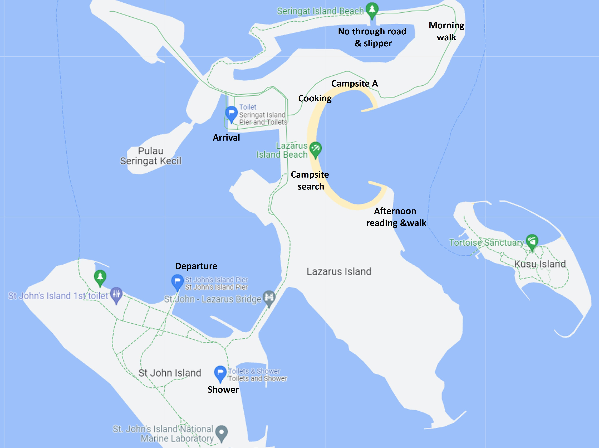

# 2022 Apr: Lazarus Camping 9-10 Apr 2022

We went camping on Lazarus Island with Chai Xun and Cassandra. Here are some notes about the trip.

<!-- more -->

## Overall notes:

-   Ferry tickets are negotiable.
-   Umbrella, hats, fans and sunscreen are essential equipments to get along with the hot sun.
-   Campsite A was very noisy at night. However, it is also the only campsite that doesn't have light shining in in the morning.
-   Multiple mosquito coils are required to ensure you don't get bitten. But you will still get bitten on the go.
-   Actual water consumption for 2 people was about 4.5L, including washing.
-   There is a functional shower at St John's Island toilet (25 minutes walk from Lazarus Island Beach) - perhaps bringing a bicycle would be more convenient.
-   There are many flies and ants during cooking - may be good to do cooking at the pavilions available on the island.
-   Butane gas lasts for very long, long enough to do a proper hotpot.
-   Cooking hotpot in a small pot is not advisable due to the long cooking time.
-   1.2kg of meat is somewhat overkill for 4 people - perhaps 800g would have been just nice.
