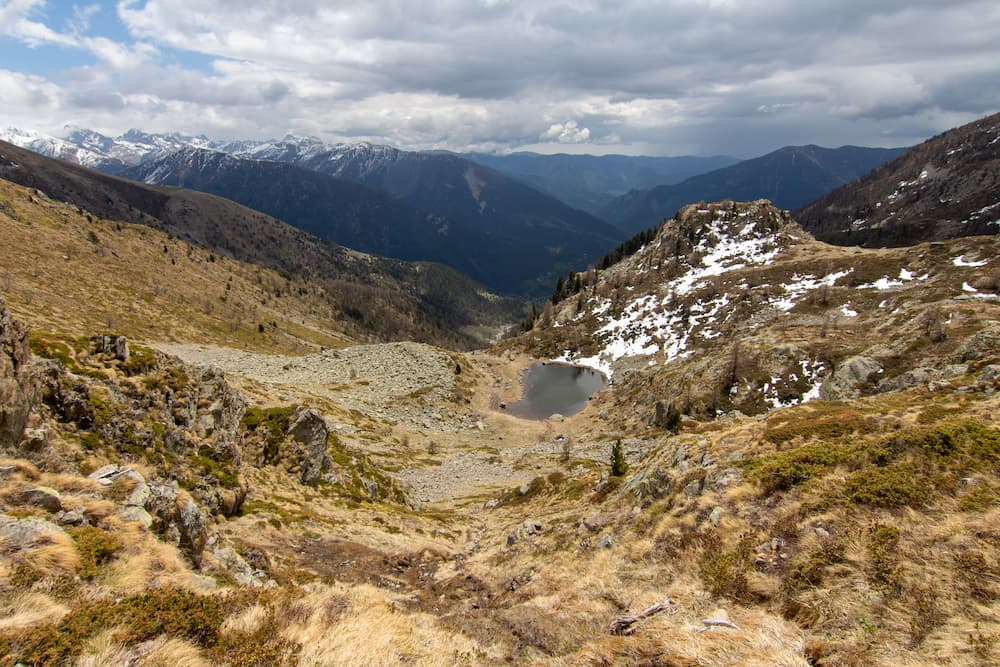
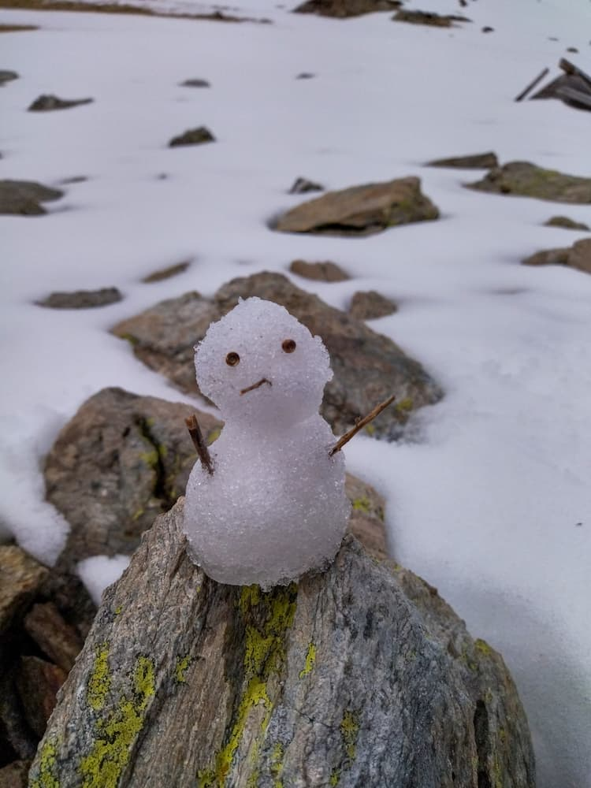

# France (Nice) Hiking 7-10 May 2022

Hiking trip in Nice.

<!-- more -->

**7 May, Saturday**

-   4.50pm: Nicholas reached NCE T1
-   We walked to a nearby Carrefour City and bought:

    -   Dinner
    -   Hiking snacks:

        -   Noodles
        -   Canned meat
        -   Some 'pate' thing
        -   Baguettes
        -   Marshmallows
        -   Apple juice

    -   Water
    -   Camping fuel
    -   Lighter

-   6.30pm: Bus 90 from [Grand Arenas][grand-arenas] to [La Colmiane][la-colmiane], 1hr 35min ([Google Maps Directions][nice-to-mercantour-bus])
-   Overnight in [hotel][hotel]

**8 May, Sunday**

-   Free breakfast at hotel
-   Checkout, fill water
-   Hiking route:

    -   [Col de Veillos, Col du Barn, Mont Pépoiri and Baus de la Frema][col-de-veillos] (16.9km loop, [.gpx file][col-de-veillos-gpx])
    -   Detour to [Lacs des Millefonts][lacs-des-millefonts] ([.gpx file][lacs-des-millefonts-gpx])
    -   [Map of routes (Chanel)][our-hiking-routes]
    -   [Other options (AllTrails)][hiking-routes]

-   We pitched our campsite on a ridge after a harrowing scramble up rocks.

-   We cooked dinner:

-   Overnight in tent, where we saw the stars and Milky Way

**9 May, Monday**

-   Begin trek back to hotel

    -   Unfortunately, route to Mt Pépoiri was inaccesible due to snow, so we made a detour further to the east.

    

-   We were offered a ride back to our hotel from the end of the trail by an elderly American couple, who asked if we were vaccinated against Covid, to which we answered in the affirmative. Nicholas took the offer for the ride, much to Chanel's distress.
-   We checked-in and enjoyed a nice shower while cleaning equipment.
-   7.30pm: We had a EUR27 dinner with quiche, salad, mustard cream chicken with potatoes, local cheese, pancakes with strawberries (all cooked by the host Cyrill himself)
-   Overnight in [hotel][hotel]

**10 May, Tuesday**

-   We were planning to take bus 90 back to Nice, but our host Cyrill kindly gave us a lift all the way to the airport.
-   We visited Old Nice and had lunch at a restaurant recommended by Cyrill.
-   Chanel very kindly bought Nicholas a bar of soap.

-   6.40pm: Flight back to Singapore (LH1065 at NCE T1)

## Misc

### Accomodation Writeup

We went in May 2022 for 2 nights of stay (and camping in the Mercantour National Park for 1 night in between). The host, Cyrill and his wife Stephanie were extremely cordial and welcoming. Cyrill gave us a lift from the La Colmiane bus stop (accesible via bus 90 from Nice). The views from the room were magnificent - the entire village below with the mountains as a backdrop. The night sky was very clear and we could see stars from the comfort of the warm room. We had dinner in the guesthouse (27 EUR) and it was cooked by Cyrill himself - the quiche was excellent. On the last day, Cyrill even offered to drop us back to the airport in Nice.

The guesthouse is situated right at the start of the hike toward the Lacs des Millefonts.

Overall, it was an extremely pleasant stay, and we enjoyed ourselves thoroughly, in no small part due to the excellent hospitality of Cyrill and his wife.

### Future Improvements

-   Get powder soups + bread for dipping
-   Prefer dried noodles/rice/pasta for carbohydrates
-   Toasted marshmallows are legit

### Bus Schedules

-   [Bus 90 schedule, in French][bus-90-french-schedule]
-   [Bus 90 schedule, English][bus-90-schedule]

### Total Cost

Approximately SGD $300 per person, all-inclusive.

A lot of the savings were due to not having to rent a car for the duration of the trip.

[bus-90-french-schedule]: https://ftp.lignesdazur.com/ligne_90.pdf
[bus-90-schedule]: https://www.lignesdazur.com/en/horaire/886/80/1
[carrefour]: https://goo.gl/maps/1eyvzNNzQiX2CUGV7
[col-de-veillos]: https://www.alltrails.com/trail/france/alpes-maritimes/col-de-veillos-col-du-barn-mont-pepoiri-et-baus-de-la-frema?u=m
[col-de-veillos-gpx]: ../static/2022-05/col_de_veillos.gpx
[grand-arenas]: https://goo.gl/maps/x726JbXk9GRtG5Fn9
[hiking-routes]: https://www.alltrails.com/explore?b_tl_lat=44.11672307739917&b_tl_lng=7.146440621716721&b_br_lat=44.04558903319381&b_br_lng=7.31264860468238
[hotel]: https://www.booking.com/hotel/fr/le-grand-chalet-valdeblore.en-gb.html
[la-colmiane-hike]: https://www.alltrails.com/explore/trail/france/alpes-maritimes/la-colmiane-col-de-varaire-caire-gros
[la-colmiane-hike-gpx]: ../static/2022-05/la_colmiane.gpx
[la-colmiane]: https://goo.gl/maps/KEguaXFsoxJszkNf8
[lacs-des-millefonts]: https://www.alltrails.com/trail/france/alpes-maritimes/lacs-des-millefonts-mont-pepoiri
[lacs-des-millefonts-gpx]: ../static/2022-05/lacs_des_millefonts.gpx
[mercantour-to-nice-bus]: https://goo.gl/maps/giMtPFhKf7s8HCce8
[nice-to-mercantour-bus]: https://goo.gl/maps/4yQzqo8yo1jFuTsC8
[our-hiking-routes]: https://www.google.com/maps/d/viewer?mid=110bE46beRht3PU2x6XfYhVFYqQdaD4gS&ll=44.14368121724446%2C7.187836335386026&z=11
[properties]: https://www.booking.com/searchresults.en-gb.html?aid=304142&label=gen173nr-1BCAEoggI46AdIM1gEaMkBiAEBmAEJuAEXyAEM2AEB6AEBiAIBqAIDuAKm5O2SBsACAdICJDJlY2Q4ZDYwLTUxMmYtNDQ3ZC1iMGVlLWMwNWI5NzdiZDNjYdgCBeACAQ&lang=en-gb&sid=5ad5ea96dc2d619c8272bbd7f2bc4453&sb=1&src=hotel&src_elem=sb&error_url=https%3A%2F%2Fwww.booking.com%2Fhotel%2Ffr%2Fle-grand-chalet-valdeblore.en-gb.html%3Faid%3D304142%3Blabel%3Dgen173nr-1BCAEoggI46AdIM1gEaMkBiAEBmAEJuAEXyAEM2AEB6AEBiAIBqAIDuAKm5O2SBsACAdICJDJlY2Q4ZDYwLTUxMmYtNDQ3ZC1iMGVlLWMwNWI5NzdiZDNjYdgCBeACAQ%3Bsid%3D5ad5ea96dc2d619c8272bbd7f2bc4453%3Ball_sr_blocks%3D237813001_178046859_2_1_0%3Bcheckin%3D2022-05-07%3Bcheckout%3D2022-05-09%3Bdest_id%3D3313%3Bdest_type%3Dregion%3Bgroup_adults%3D2%3Bgroup_children%3D0%3Bhapos%3D1%3Bhighlighted_blocks%3D237813001_178046859_2_1_0%3Bhpos%3D1%3Bmatching_block_id%3D237813001_178046859_2_1_0%3Bno_rooms%3D1%3Breq_adults%3D2%3Breq_children%3D0%3Broom1%3DA%252CA%3Bsb_price_type%3Dtotal%3Bsr_order%3Dpopularity%3Bsr_pri_blocks%3D237813001_178046859_2_1_0__17720%3Bsrepoch%3D1650160200%3Bsrpvid%3Ded8f0ce3ba7c0157%3Btype%3Dtotal%3Bucfs%3D1%26%3B&highlighted_hotels=2378130&hp_sbox=1&ss=Valdeblore&is_ski_area=0&ssne=Valdeblore&ssne_untouched=Valdeblore&dest_id=3313&dest_type=region&checkin_year=2022&checkin_month=5&checkin_monthday=7&checkout_year=2022&checkout_month=5&checkout_monthday=10&group_adults=2&group_children=0&no_rooms=1&from_sf=1
[saint-dalmas]: https://goo.gl/maps/peDVK6vxcCPVxM9T9
[supermarche-casino]: https://goo.gl/maps/CVW2jDJPWHptKZBu6
[trekking-map]: https://www.openstreetmap.org/relation/1024511#map=10/44.1674/7.0615
[weather]: https://www.weather-atlas.com/en/france/paris-weather-may
