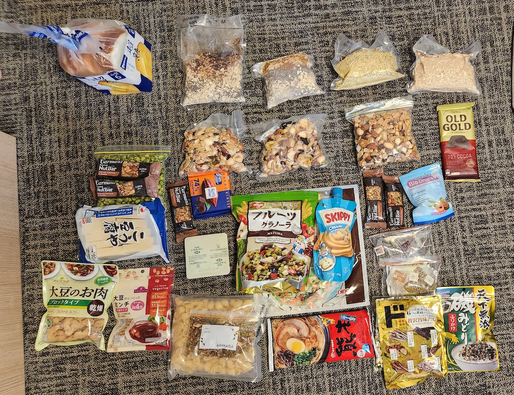

# Japan Hiking Planning

<figure style="max-width:300px">
  
  <figcaption>Panorama Ginza Trail (click to enlarge)<figcaption/>
</figure>

## Itinerary (9 days)

Jun 29, Thu:

-   2215 - 0615 (7hr) Flight from Singapore T1 to Tokyo Narita T1 ([TR 808][itinerary])

Jun 30, Fri:

-   0615 Arrive at Tokyo Narita T1
-   Train to Shinjuku ([routes][narita-transport])
    -   Option A: JR Narita Express TOKYO Round Trip Tickets (¥4,070) ([guide][nex-train])
    -   Option B: Keisei Main Line to Nippori Station (¥1,050, 80min) & Transfer to JR Yamanote Line to Shinjuku Station (¥210)
-   Purchase supplies at Don Quijote 24HR (Food), [Yamarent][yamarent], [L-breath][lbreath] (Fuel & Gear)
-   Eat at Ichiran Ramen/ Udon Shin
-   1500 Hourly Limited Express Direct Azusa from Shinjuku to Matsumoto (¥6,620) ([schedule][azusa-train-schedule])
-   Explore Matsumoto ([map][matsumoto-map])
-   [x] Overnight at [Iroha Grand Hotel Matsumoto Eki-Mae ($85)][iroha-grand-hotel]

Jul 1, Sat (Total Trek Time: 2.5hrs):

-   0900 Train/Bus to Kamikochi (¥2,500, [schedule][kamikochi-bus-info])
-   1200 Lunch at Kamikochi
    -   Pick up a map from the info centre
    -   Stock up on any supplies you may need
    -   Water is free here
    -   Fill out [mountain climbing card][trek-itinerary] and put it in the box at the start of the Dakasawa trailhead ()
-   Begin Kamikochi Trail ([gpx file][kamikochi-gpx])/ backup: Panorama Trail ([gpx file][panorama-gpx])
-   Hike to Dakasawa Mountain Hut (2.5 hrs, +660m)
-   Overnight at [Dakasawa Mountain Hut][dakasawa]
-   Notes: Reservations are not required for tent sites (First Come First Serve Basis)

Jul 2, Sun (Total Trek Time: 8hrs):

-   Dakasawa -> Mt Mae-Hotaka (3.5 hrs, +925m) -> Mt Hotaka (3 hrs) -> Karasawa (2 hrs, -880m)
-   Overnight at [Karasawa Hut, Water point][karasawa]

Jul 3, Mon (Total Trek Time: 6hrs):

**Decision Point to turn back to Kamikochi**

-   Karasawa -> Yoku Valley (2 hrs, -690m) -> Yokoo Junction (4 hrs, +1,000m) -> Chogatake Hutte (0.5 hrs))
-   Overnight at [Chogatake Hutte Mountain Hut][chogatake]

Jul 4, Tue (Total Trek Time: 9hrs):

-   Chogatake -> Mount Jonen (5 hrs) -> Daitenso (4 hrs)
-   Overnight at [Daitenso Mountain Hut][daiten-sou]

Jul 5, Wed (Total Trek Time: 6hrs):

-   Daitenso -> Mount Tsbakuro (3 hrs) -> Ariake-sou (3 hrs)
-   Overnight at [Nakabusa][nakabusa] (¥13,500/pax for shared room max 4pax, or ¥2000/stay for tent)

Jul 6, Thu:

-   0900 Regular bus from Nakabusan Onsen to Hotaka Station (55min, [schedule][nakabusa-bus-schedule])
-   Explore Azumino
    -   Visit Daio Wasabi Farm, Foot Hot Spring, Swiss Village, Museums
    -   Soba for Lunch
-   1200 Cycle from Azumino to Matsumoto ([route][azumino])
-   Travel to Nagiso ([routes][matsumoto-tsumago])
    -   Option A: 1500 Take Shinano No. 16/18 (¥ 3,000, 1hr)
    -   Option B: 1600 JR Shinonoi Line/JR Chuo Main Line (¥1,500, 2hr) to Nagiso
-   [x] Overnight at Nagiso ([お宿 勝, $150][nagiso-accoms])

Jul 7, Fri:

-   0840 Bus from Nagiso Station to Tsumago ([schedule][nagiso-bus-schedule])
-   0900 Magome-Tsumago Trail (6.6km, 2hr 15min, [gpx file][magome-tsumago]), end at Magome
-   [x] 1130-1613 Express bus from Chuodo-Magome ([map][chuodo-magome-bus-stop]) to Shinjuku ([ticket][magome-shinjuku])
-   Explore Kabukicho, Omoide Yokocho in Shinjuku
-   [x] Overnight at Tokyo ([Shinjuku Granbell, $135][shinjuku-granbell])

Jul 8, Sat:

-   Souvenir Shopping
    -   Shibuya: Shibuya Center-gai, Shibuya Crossing, Scramble Square, Mandarake manga store and Meikyoku Kissa Lion classical music cafe
    -   Yokohama: Chinatown, Motomachi Shopping District, Cup Noodle Factory, Gundam Factory
-   Take Narita Express Train from Shibuya/Yokohama to Narita Airport
-   [x] Overnight at Tokyo in [Narita Tobu Hotel Airport ($119)][airport-hotel]

Jul 9, Sun:

-   0530: Take shuttle bus to Narita T1 ([schedule][airport-shuttle-schedule])
-   0815 - 1350 (6h 35min) Flight from Tokyo Narita T1 to Singapore T1 ([TR 809][itinerary])

## Meal Plan

### Day 0

- B/L: Shin Udon/ Ichiran Ramen @ Tokyo
- D: Soba @Matsumoto

### Day 1

- B: 7-eleven pao
- L: @Kamikochi
- D: Curry fresh udon, miso soup (x2), herb tea (x2)
- S: Cucumbers (x2), apple (x2), cherry tomatoes

### Day 2

- B: Granola (100g) + oats (200g) with cinnamon, powdered oat milk, chia seeds, psyllium husk and PB, miso soup (x2), black tea (x2)
- L: Tortilla + granola (150g) with cinnamon and PB / KIV bread from Family Mart
- S: Nutbar (x3), dried fruit/nuts (150g)
- D: Ramen (200g), ginger tea (x2) 

### Day 3

- B: Mushroom soup (x2)+ Oats (200g), green tea (x2)
- L: Tortilla + granola (150g) with cinnamon, chia seeds, psyllium husk and PB
- S: Nutbar (x2), wasabi peas, dried fruit/nuts (100g)
- D: Curry mushroom tomato one pot pasta (300g), miso soup (x2), tea (x2) / Meal at hut

### Day 4

- B: Granola (100g) + oats (200g) with cinnamon, powdered oat milk, chia seeds, psyllium husk and PB, miso soup (x2), oolong tea (x2)
- L: Tortilla + granola/nuts (150g)
- S: Wasabi peas, dried fruit/nuts (100g)
- D: Somen noodles (300g) with tofu miso soup (x2), Campfire s'mores (marshmallows + melted dark choc), fruit tea (x2)

### Day 5 

- B: Polenta (300g) + seasoning, miso soup (x2), earl grey tea (x2) 
- L: Ramen noodles (200g)
- D: @ Nakabusa Onsen

### Day 6

- B: Azumino Wasabi Farm
- L: Soba @ Matsumoto
- D: @ Nagiso 

### Day 7

- B: @ Nagiso
- L: on the bus
- D: @ Shinjuku

### Day 8

- Plan on the

### Day 9

- B: @Airport

## Packing List

### On the day

- T-shirt/jeans
- Slippers/Crocs
- Travel adaptor & cable
- Powerbank
- Handphone
- Wallet, cash & youtrip card
- Passport
- Earplugs
- Eye mask
- Kindle/Kobo
- Laptop + charger

### In Japan

- Helmet - rent at Kamikochi Visitor Center
- Camping Gas

### Miscellaneous

- First aid kit (plasters, dressings, diarrhea meds, panadol)
- Plastic bags
- Ziploc bags
- Face mask (Chanel)
- Duct tape?
- Camera (KIV)

### Navigation

- Compass
- Gaia maps app with map files loaded
- Physical map (take from visitor center)

### Clothing

- Fleece
- Down jacket
- Waterproof jacket
- Gloves
- Socks
- Thermal wear top
- Thermal wear bottom
- Underwear
- City attire (T-shirt/jeans/s attire) (Chanel)
- Trekking shoes (Chanel)
- Sunglasses

### Toiletries

- Toothbrush, toothpaste, shaver (Chanel)
- Soap
- Shampoo
- Moisturizer
- Sunscreen
- Lip balm
- Hand sanitizer
- Powder detergent (to wash clothes)
- Toilet paper
- Body/ Wet wipes (Chanel)

### Cooking

- Liquid detergent (in bottle, small amount) 
- Stove (Nicholas)
- Pots + Cutlery (Nicholas)
- Water purification tablets (Nicholas)
- Sponge
- Water bottle (at least 2L)
- Thermos flask (optional)

### Camping Gear

- Backpack 60L
- Head lamp with battery
- Sleeping bag
- Sleeping bag liner
- Towel
- Penknife
- Chair (Nicholas)
- Tent (Nicholas)

## Reference Maps & Guides

-   [Kamikochi Trail GPX][kamikochi-gpx]
-   [Panorama Ginza Trail GPX][panorama-gpx]
-   [Kiso Valley Trail GPX][magome-tsumago]
-   [Kamikochi Map][hike-map] ([trekking guide][trek-guide])
-   \[3 - 4 days\] [Panorama Ginza Trail][panorama-ginza] ([Map][panorama-ginza-map]) ends at [Nakabusa Onsen][nakabusa-onsen]
-   \[2- 3 days\] [Mt Hotaka Loop][mt-hotaka] similar to the reddit one you shared
-   https://thejapanalps.com/en/route/mt-hotaka/route-02/
-   https://randomwire.com/mount-hotaka-revisited/
-   https://thejapanalps.com/en/nakata-map/okuhotaka/
-   https://thejapanalps.com/en/route/mt-yarigatake/

## Cost: ~$1800

-   Flights: $615
-   \[4N\] Accoms: $489/2 = ~$245
-   \[4N\] Tent space: ~$100
-   Food: ~$400
-   Transport: ~$200
    -   Within Tokyo: ~$40
    -   Shinjuku to Kamikochi: ~$100
    -   Kamikochi to Nagiso: ~$30
    -   Magome to Shinjuku: ~$64/2 = $32
-   Others:
    -   Insurance: ~$56/2 = $28

## Suggested Treks for Nicholas (Flights not included)

-   \[8D7N\] [India Tarsar Marsar Trek 4021m in Aug for SGD575][india-trek]
-   \[7D6N\] [North Africa Jebel Toubkal 4,167m for SGD899][north-africa-trek]
-   \[9D8N\] [Russia Mount Elbrus 5642m for SGD1675][russia-trek]
-   \[20D19N\] [Tajikistan Lenin Peak 7,134m in Jul for USD2200][tajikistan-trek]

## Thoughts, Notes

Japan is kinda expensive since we have to pay for campgrounds which is $20 per pax and accommodations is like $100 per pax. I am okay to KIV but putting the resources here if we are interested next time. On other hand, there are planned hiking treks that looks really reasonable and cool.

[yamarent]: https://www.yamarent.com/en?language=en
[lbreath]: https://goo.gl/maps/TC7o16L62ei5oeJ68
[l-breath]: https://goo.gl/maps/dee1KP58vdfVVJot7
[azumino]: https://www.snowmonkeyresorts.com/2019/04/cycling-through-rural-azumino-to-matsumoto-castle/
[matsumoto-map]: https://visitmatsumoto.com/wp-content/uploads/2023/04/TownWalkingMap_EN.pdf
[hike-map]: https://www.hikemasterjapan.com/_files/ugd/60507d_b5b49614a7f740b98684e04c7a4e462a.pdf?index=true
[trek-guide]: https://www.kamikochi.org/plan/trekking
[trek-itinerary]: https://www.pref.nagano.lg.jp/kankoki/smartphone/trekking.html
[panorama-ginza]: https://www.hikemasterjapan.com/panoramaginza
[panorama-ginza-map]: https://static.wixstatic.com/media/60507d_88f3c201ff294078b635af703a2eae9e~mv2.jpg?dn=Kamikochi%20Map%20Azumino%20Panorama%20Ginza.jpg
[mt-hotaka]: https://www.hikemasterjapan.com/hotaka
[dehydrate-food]: https://www.rei.com/learn/expert-advice/how-to-dehydrate-food.html
[kamikochi-gpx]: /static/2023-04-07/2023-06-kamikochi.gpx
[panorama-gpx]: /static/2023-04-07/2023-06-panorama.gpx
[magome-tsumago]: /static/2023-04-07/magome-tsumago.gpx
[iroha-grand-hotel]: https://www.booking.com/Share-MYTWNC
[dakasawa]: https://thejapanalps.com/en/mountain-hut/takesawagoya/
[karasawa]: https://thejapanalps.com/en/mountain-hut/karasawahyutte/
[chogatake]: https://thejapanalps.com/en/mountain-hut/chogatake/
[daiten-sou]: https://thejapanalps.com/en/mountain-hut/daitenso/
[nakabusa]: https://thejapanalps.com/en/access-nakabusa/
[nagiso-accoms]: https://www.booking.com/Share-QgwY131
[shinjuku-granbell]: https://secure.booking.com/confirmation.en-gb.html?aid=337862;auth_key=CGyWzSDRKiH2Akaf&;source=conf_email;pbsource=conf_email_modify;pbtrack=email_mainCTA;from_conf_email_tracking=1
[airport-hotel]: https://www.booking.com/hotel/jp/holiday-inn-tobu-narita.html
[narita-transport]: https://tokyocheapo.com/travel/narita-to-shinjuku/
[nex-train]: https://tokyocheapo.com/travel/narita-express-nex/
[azusa-train-schedule]: https://www.snowmonkeyresorts.com/wp-content/uploads/2022/03/Shinjuku-Matsumoto-1.png
[matsumoto-train]: https://japantravel.navitime.com/en/area/jp/route/result?start=00003876&goal=00007171&start_name=Matsumoto&goal_name=Nagiso&date_time=2023-07-06T15%3A36
[kamikochi-bus-info]: https://www.kamikochi.org/pdf/Kamikochi_Leaflet.pdf
[nakabusa-bus-schedule]: https://azumino-e-tabi.net/pdf/p3-4.pdf
[matsumoto-tsumago]: https://japantravel.navitime.com/en/area/jp/route/result?start=00003876&goal=00007171&start_name=Matsumoto&goal_name=Nagiso&date_time=2023-07-06T15%3A36
[nagiso-bus-schedule]: https://www.japan-guide.com/bus/kiso.html
[magome-shinjuku]: https://www.kousokubus.net/JpnBus/en/WebTicket/Index/busnetticket-20230606233731.pdf?key=Pov6rzaByzpoCd7vkMw4EoL7SfRA9m32
[magome-bus]: https://www.kousokubus.net/JpnBus/en
[magome-bus-info]: http://time.jrbuskanto.co.jp.e.wn.hp.transer.com/bk06020.html
[chuodo-magome-bus-stop]: https://goo.gl/maps/QVXinZNFBQdWWkSD7?coh=178571&entry=tt
[airport-shuttle-schedule]: https://www.tobuhotel.co.jp/narita/access/pdf/bus_tt_img_airport_02.pdf
[willer]: https://willerexpress.com/en/bus_search/tokyo/all/nagano/kamikochi/ym_202306/day_28/?stockNumberMale=1&stockNumberFemale=1
[alpico]: http://sawayaka.alpico.co.jp/
[climbing-bus]: https://bus.maitabi.jp/tour_catsearch.html?departure=1&month=7&area=17&style=3&page=1
[itinerary]: /static/2023-04-07/itinerary.pdf
[india-trek]: https://sgtrek.com/event/kashmir-tarsar-marsar-trek-2023/
[north-africa-trek]: https://sgtrek.com/event/climb-mt-toubkal-2023/
[russia-trek]: https://sgtrek.com/event/mt-elbrus-classic-south-route-2023/
[tajikistan-trek]: https://sgtrek.com/event/guided-expeditions-to-lenin-peak-2023/
